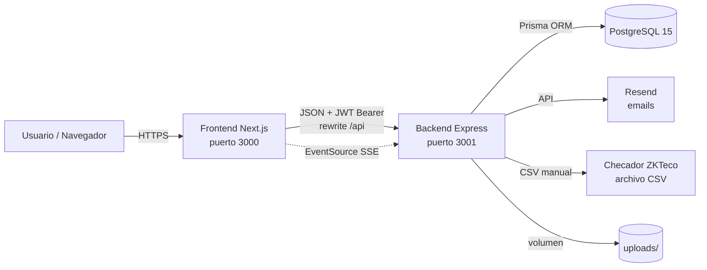

# Contexto del Proyecto — ERP KRAM (Mini-ERP-Kram)

> Documento generado por análisis estático del repositorio (solo lectura) el 2026-09-15.
> Fuentes: código en `backend/src`, `frontend/`, `backend/prisma/schema.prisma`, configuración Docker/CI, y la documentación previa en `docs/` (contrastada contra el código; donde ambas discrepan se indica explícitamente).
>
> **Nota sobre el alcance:** este ERP es un sistema de RH/administración para **Comercializadora KRAM**. La estructura de este documento sigue el índice solicitado, adaptando cada sección a lo que realmente existe en el código.

---

## 1. Resumen general

**ERP KRAM** es una aplicación web de gestión empresarial para **Comercializadora KRAM**, con módulos de Recursos Humanos (empleados, reclutamiento, vacaciones, incidencias/asistencia, incapacidades, disciplina, periodo de prueba) y de Compras (solicitudes, cotizaciones, órdenes de compra, papelería, uniformes, inventario). Incluye un sistema de permisos dinámico basado en **roles** y **módulos** (`README.md:1-3`, `docs/ACCESOS_Y_PERMISOS.md:8-15`).

- **Arquitectura**: frontend y backend desacoplados — Next.js (App Router) consumiendo una API REST en Express (`docs/ARQUITECTURA.md:5-25`).
- **Despliegue**: pensado para producción en un VPS/Coolify con dominios propios (`erp.kramhub.site` / `apierp.kramhub.site`) vía Docker Compose + Traefik (`docs/DEPLOYMENT.md:1-24`, `backend/.env.example:22-24`). No hay evidencia en el repo de que el despliegue objetivo sea una red local sin Internet: las variables de entorno, CORS y Dockerfiles están orientados a dominios públicos con HTTPS **(inferido)**.
- **Usuarios objetivo**: personal interno de KRAM — empleados (autoservicio), jefes de área, y los roles administrativos ADMIN/RH/SISTEMAS/COMPRAS/PRODUCCION (`docs/ACCESOS_Y_PERMISOS.md:19-32`).
- El repositorio contiene, además del código, una carpeta `docs/` con documentación previa extensa (manuales, flujos Mermaid, ADRs) y `docuold/` con documentación archivada. Este documento la usa como referencia pero prioriza lo verificable en el código; varias partes de `docs/` están desactualizadas respecto al esquema y las rutas actuales (ver sección 12).

---

## 2. Stack tecnológico

| Capa | Tecnología | Versión (real, de `package.json`) |
|---|---|---|
| Backend runtime | Node.js | 20 (`node:20-slim`, `backend/Dockerfile:8`) |
| Framework backend | Express | `^4.18.2` (`backend/package.json:44`) |
| ORM | Prisma | `^5.7.0` (cliente `@prisma/client ^5.7.0`) (`backend/package.json:38,58`) |
| Base de datos | PostgreSQL | `15-alpine` (`docker-compose.yml:5`) |
| Auth | jsonwebtoken | `^9.0.2` (`backend/package.json:48`) |
| Hash de contraseñas | bcrypt / bcryptjs | `^6.0.0` / `^2.4.3` (`backend/package.json:39-40`) |
| Uploads | multer | `^2.0.2` (`backend/package.json:49`) |
| Rate limiting | express-rate-limit | `^8.6.2` (`backend/package.json:45`) |
| Validación backend | express-validator | `^7.0.1` (`backend/package.json:46`) — confirmado: es el **único** archivo de rutas que lo usa en todo el backend (`grep -r "express-validator" backend/src` → solo `auth.routes.js`); valida `register` (email/password≥6/name/role), `login` (email/password) y `change-password` (currentPassword/newPassword≥6). Los otros ~27 archivos de rutas no lo importan; validan manualmente en el controller/service (ver §12.4) |
| Seguridad HTTP | helmet | `^8.3.0` (`backend/package.json:47`) |
| Cron | node-cron | `^4.2.1` (`backend/package.json:50`) |
| PDF (backend) | pdfkit | `^0.19.1` (`backend/package.json:51`) |
| Excel (backend) | xlsx (SheetJS) | `^0.18.5` (`backend/package.json:53`) |
| CSV | csv-parser | `^3.2.0` (`backend/package.json:42`) |
| Email | Resend | `^6.12.4` (`backend/package.json:52`) |
| Testing backend | Jest + Supertest | `^30.4.2` / `^7.2.2` (`backend/package.json:56,59`) |
| Frontend framework | Next.js (App Router) | `14.2.21` (`frontend/package.json:20`) |
| UI | React / Tailwind CSS | `^18.3.1` / `^3.4.17` (`frontend/package.json:22-23,28`) |
| HTTP client | axios | `^1.7.9` (`frontend/package.json:16`) |
| Formularios | react-hook-form + @hookform/resolvers + zod | `^7.54.2` / `^3.9.1` / `^3.24.1` (`frontend/package.json:13-14,30`) — **usado de forma inconsistente**, ver §10 |
| PDF (frontend) | jspdf + jspdf-autotable | `^4.2.1` / `^5.0.8` (`frontend/package.json:17-18`) |
| Excel (frontend) | xlsx | `^0.18.5` (`frontend/package.json:29`) |
| Drag & drop | @hello-pangea/dnd | `^18.0.1` (`frontend/package.json:13`) — usado en el Kanban de reclutamiento |
| Gráficas | recharts | `^3.8.1` (`frontend/package.json:26`) |
| Infraestructura | Docker + Docker Compose + GitHub Actions | — (`docker-compose.yml`, `docker-compose.prod.yml`, `.github/workflows/*.yml`) |

**No están presentes** (a diferencia de lo que podría suponerse en otros ERPs similares): Zustand, TanStack Query/React Query, Redis. Confirmado por ausencia en `package.json` de ambos proyectos y por búsqueda en el código (`grep -r "zustand|@tanstack/react-query" frontend/` sin resultados).

---

## 3. Arquitectura y despliegue

### 3.1 Diagrama de componentes


(`docs/ARQUITECTURA.md:9-17`, confirmado por `backend/src/index.js:143,177` y `frontend/lib/api/client.js`)

### 3.2 Servicios definidos en Docker Compose

**`docker-compose.yml` (desarrollo local, raíz del repo):**

| Servicio | Imagen | Puerto | Propósito |
|---|---|---|---|
| `postgres` | `postgres:15-alpine` | `5432:5432` | Base de datos, con healthcheck `pg_isready` (`docker-compose.yml:4-23`) |
| `pgadmin` | `dpage/pgadmin4:latest` | `5050:80` | UI de administración de BD (`docker-compose.yml:25-37`) |

En este modo, backend y frontend se corren localmente con `npm run dev` (no están en el compose de desarrollo) — confirmado por `README.md:56-73`.

**`docker-compose.prod.yml` (producción / Coolify):**

| Servicio | Build | Depende de | Notas |
|---|---|---|---|
| `postgres` | `postgres:15-alpine` | — | Sin puertos publicados; solo red interna `kram-network` (`docker-compose.prod.yml:4-26`) |
| `backend` | `./backend/Dockerfile` | `postgres` (healthy) | Puerto 3001 interno; volumen `backend_uploads:/app/uploads` (`docker-compose.prod.yml:28-61`) |
| `frontend` | `./frontend/Dockerfile` | `backend` | Puerto 3000 expuesto solo internamente (`expose`, no `ports`); Traefik/Coolify enruta desde fuera (`docker-compose.prod.yml:63-91`) |

El enrutamiento HTTPS externo lo asume **Traefik gestionado por Coolify**, fuera de este repositorio; ningún compose del repo define un proxy propio (`docs/DEPLOYMENT.md:7-13`).

- **Volúmenes**: `postgres_data` (datos de BD) y `backend_uploads` (CVs, fotos, documentos, cotizaciones, órdenes de compra en PDF) — ambos deben persistir entre despliegues (`docs/DEPLOYMENT.md:72-79`).
- **Red**: una sola red bridge `kram-network` compartida por los tres servicios.
- **Comunicación**: el frontend llama al backend vía `NEXT_PUBLIC_API_URL` (por defecto `http://backend:3001` dentro de Docker) y, en el navegador, vía un rewrite de Next hacia `/api` (`frontend/lib/api/client.js`, según agente de exploración de frontend).

### 3.3 Arranque del backend en producción

El `CMD` de `backend/Dockerfile:92-98` ejecuta, en orden: `node scripts/resolve-migrations.js` (resuelve migraciones fallidas) → `npx prisma migrate deploy` → inicio de `src/index.js`. El seed de producción (`node prisma/seed-prod.js`) está **comentado** en el Dockerfile — se ejecuta manualmente o vía `POST /api/seed/reset` (`backend/Dockerfile:89-96`, `docs/DEUDA_TECNICA.md:29`).

### 3.4 Estructura en 3 capas del backend

```
routes/ → controllers/ → services/
```
Las rutas montan middlewares de auth/permisos y delegan; los controladores son delgados (validan, llaman al servicio, responden `{ data, message }` o `{ error }`); los servicios contienen la lógica de negocio y son el único lugar donde se usa Prisma para operaciones complejas (`docs/ARQUITECTURA.md:55-75`, confirmado por la organización real de `backend/src/services/*`).

---

## 4. Estructura de carpetas

```
Mini-ERP-Kram/
├── backend/
│   ├── prisma/
│   │   ├── schema.prisma          ← modelo de datos completo (942 líneas, ver §5)
│   │   ├── migrations/            ← migraciones Prisma
│   │   └── seed*.js                ← seed dev/prod/demo/estructura-rh/factores
│   ├── src/
│   │   ├── assets/                ← logo-kram.png (fuera de /uploads, no es volumen)
│   │   ├── config/                ← modules.config.js, roles.config.js, company.config.js (fuentes de verdad)
│   │   ├── controllers/           ← ~30 controladores HTTP delgados
│   │   ├── middlewares/           ← auth, permission, rate-limit, sse, upload
│   │   ├── routes/                ← ~28 archivos de rutas Express
│   │   ├── services/              ← lógica de negocio, subcarpetas por dominio (purchases/, vacaciones/, incapacidades/, empleados/, reportes/, auth/)
│   │   ├── utils/                 ← attendance, auth, csvMapper, salaryCalculator, topoSort
│   │   └── index.js               ← punto de entrada Express
│   ├── scripts/                   ← scripts de mantenimiento/migración de datos (uso manual, no CI)
│   ├── tests/                     ← Jest + Supertest (integración) y tests/unit (unitarias)
│   └── Dockerfile
├── frontend/
│   ├── app/                       ← páginas Next.js App Router (~50 `page.js`, casi todas `'use client'`)
│   ├── components/                ← componentes reutilizables (formularios, modales, layout)
│   ├── contexts/                  ← AuthContext.js (estado global de sesión)
│   ├── hooks/                     ← useAuthorization.js, usePurchaseItems.js
│   ├── lib/api/                   ← un archivo cliente por dominio + client.js (axios)
│   ├── constants/                 ← navigation.js (menú del sidebar)
│   └── Dockerfile
├── docs/                          ← documentación previa (manuales, flujos Mermaid, ADRs) — parcialmente desactualizada, ver §12
├── docuold/                       ← documentación archivada
├── .github/workflows/             ← backend-ci.yml, frontend-ci.yml
├── docker-compose.yml             ← postgres + pgadmin (desarrollo)
├── docker-compose.prod.yml        ← postgres + backend + frontend (producción)
└── init-db/                       ← scripts de inicialización de PostgreSQL (montados en el contenedor postgres)
```

> **Nota**: en la raíz del repositorio hay numerosos archivos sueltos sin relación con el código de la app (CSVs de prueba, scripts `.js` de corrección de datos de RH, `kram_rh_suite_v1.0.html`, logs, `.txt` de commits) que parecen artefactos de trabajo temporal y no forman parte de la aplicación **(inferido; no se modificaron ni se documentan más a fondo por estar fuera del alcance de esta tarea)**.

---

## 5. Modelo de datos

> Fuente: `backend/prisma/schema.prisma` (942 líneas), leído íntegramente. **Esta sección refleja el schema real**, que incluye varios modelos NO documentados en `docs/MODELO_DATOS.md` (ver discrepancias en §12): `PurchaseResponsiva`, `Supplier`, `HrAuditLog`, `ProbationEvaluation`, `DisciplinaryIncident`, `Incapacidad`, `SystemSetting`.

### 5.1 Diagrama entidad-relación

```mermaid
erDiagram
    USER ||--o| EMPLOYEE : "1:1 (userId)"
    USER ||--o{ SESSION : tiene
    USER ||--o{ VACANCY_COMMENT : escribe
    USER ||--o{ PURCHASE_COMMENT : escribe
    USER ||--o{ STATIONERY_COMMENT : escribe
    USER ||--o{ INVENTORY_ADJUSTMENT_REQUEST : "aprueba (Nivel C)"
    USER ||--o{ INVENTORY_MOVEMENT : registra
    USER ||--o{ VACATION_REQUEST : "aprueba / autoriza-jefe"
    USER ||--o{ INCAPACIDAD : registra
    USER ||--o{ PROBATION_EVALUATION : evalua
    USER ||--o{ DISCIPLINARY_INCIDENT : registra

    DEPARTMENT ||--o{ EMPLOYEE : tiene
    DEPARTMENT ||--o{ JOB_POSITION : tiene
    DEPARTMENT ||--o{ JOB_VACANCY : tiene
    DEPARTMENT ||--o{ PURCHASE_REQUEST : tiene
    DEPARTMENT ||--o{ STATIONERY_REQUEST : tiene
    DEPARTMENT ||--o{ PURCHASE_RESPONSIVA : tiene

    EMPLOYEE }o--|| DEPARTMENT : pertenece
    EMPLOYEE }o--o| JOB_POSITION : ocupa
    EMPLOYEE ||--o{ EMPLOYEE : "reportaA (autojerarquía)"
    EMPLOYEE ||--o{ EMPLOYEE_DOCUMENT : tiene
    EMPLOYEE ||--o{ SALARY_HISTORY : tiene
    EMPLOYEE ||--o{ NOTIFICATION_LOG : recibe
    EMPLOYEE ||--o{ JOB_VACANCY : "solicita / autoriza / VoBo"
    EMPLOYEE ||--o{ PURCHASE_REQUEST : "solicita / autoriza"
    EMPLOYEE ||--o{ PURCHASE_RESPONSIVA : "recibe / entrega"
    EMPLOYEE ||--o{ PURCHASE_APPROVER : es
    EMPLOYEE ||--o{ STATIONERY_REQUEST : "solicita / entrega"
    EMPLOYEE ||--o{ UNIFORM_DELIVERY : "recibe / entrega"
    EMPLOYEE ||--o{ INVENTORY_ADJUSTMENT_REQUEST : solicita
    EMPLOYEE ||--o{ VACATION_REQUEST : solicita
    EMPLOYEE ||--o{ INCAPACIDAD : tiene
    EMPLOYEE ||--o{ PROBATION_EVALUATION : tiene
    EMPLOYEE ||--o{ DISCIPLINARY_INCIDENT : tiene

    JOB_VACANCY ||--o{ CANDIDATE_RH : candidatos
    JOB_VACANCY ||--o{ JOB_ACTIVITY : actividades
    JOB_VACANCY ||--o{ VACANCY_COMMENT : comentarios

    PURCHASE_REQUEST ||--o{ PURCHASE_ITEM : items
    PURCHASE_REQUEST ||--o{ PURCHASE_QUOTE : cotizaciones
    PURCHASE_REQUEST ||--o{ PURCHASE_COMMENT : comentarios
    PURCHASE_REQUEST ||--o{ PURCHASE_APPROVER : aprobadores
    PURCHASE_REQUEST ||--o{ PURCHASE_RESPONSIVA : responsivas
    PURCHASE_REQUEST ||--o| PURCHASE_ORDER : orden
    PURCHASE_ORDER ||--o{ PURCHASE_ORDER_ITEM : partidas
    SUPPLIER ||--o{ PURCHASE_QUOTE : cotiza
    SUPPLIER ||--o{ PURCHASE_ORDER : surte

    STATIONERY_REQUEST ||--o{ STATIONERY_ITEM : items
    STATIONERY_REQUEST ||--o{ STATIONERY_COMMENT : comentarios
```



**Tablas sin relaciones FK (independientes)**: `AttendanceRecord` (checadas ZKTeco), `FactorIntegracion` (factores LFT por año de antigüedad), `HrAuditLog` (auditoría genérica de RH, referencia lógica por `entidadTipo`/`entidadId` sin FK real), `SystemSetting` (interruptores clave/valor), `PurchaseAuditLog` (auditoría de compras, referencia lógica a `requestId`/`userId` sin FK). `StationeryInventory` y `UniformInventory` tampoco tienen FK entrantes desde otras tablas (se referencian por `itemId` textual desde `InventoryAdjustmentRequest`/`InventoryMovement`).

### 5.2 Tablas principales (agrupadas por dominio)

**Identidad y acceso**

| Modelo | Tabla | Campos únicos | Nullable relevante | Descripción |
|---|---|---|---|---|
| `User` | `users` | `email` | — | Cuenta de acceso. `role: String` (no FK a enum en BD, ver §12), `accessibleModules: ModuleType[]` (`schema.prisma:10-34`) |
| `Role` | `roles` | `name` | `description` | Roles personalizados (`isCustom`); los roles de sistema NO viven aquí, ver §6 (`schema.prisma:36-47`) |
| `Session` | `sessions` | `token` | — | Sesión JWT persistida, `onDelete: Cascade` desde `User` (`schema.prisma:49-58`) |

**Estructura organizacional**

| Modelo | Tabla | Campos únicos | Descripción |
|---|---|---|---|
| `Department` | `departments` | `nombre` | Departamentos (`schema.prisma:226-241`) |
| `JobPosition` | `job_positions` | `[nombre, departamentoId]` | Puestos por departamento (`schema.prisma:243-258`) |
| `Employee` | `employees` | `curp`, `nss`, `rfc`, `clave`, `userId` | Expediente completo (~55 campos): identidad legal, contacto, domicilio, datos bancarios, beneficiarios, tallas de uniforme, jerarquía (`reportaAId`, autorrelación `Jerarquia`), sueldo (`sd`, `sdi`, `salarioMensual` mapeado a columna `salary`). Índice `[departamento_id, estatus]` (`schema.prisma:60-148`). **Duplicidad de campo** `nombre` vs `nombres` (ambos `String?`, líneas 98 y 111) — deuda técnica conocida (`docs/DEUDA_TECNICA.md:16`). |

**Reclutamiento**

| Modelo | Tabla | Descripción |
|---|---|---|
| `JobVacancy` | `job_vacancies` | Solicitud de vacante digitalizada del formato físico; incluye campos de requerimientos técnicos/físicos, promoción interna (Json), motivo (`enum MotivoVacante`, 19 valores) (`schema.prisma:150-208`) |
| `JobActivity` | `job_activities` | Actividades del puesto, con prioridad y estado de completado (`schema.prisma:210-224`) |
| `CandidateRH` | `candidates_rh` | Candidatos con CV y prueba psicométrica, estatus (`En_Revision/Descartado/Seleccionado`) (`schema.prisma:290-303`) |
| `VacancyComment` | `vacancy_comments` | Comentarios (chat) sobre una vacante (`schema.prisma:277-288`) |

**Compras** (append-only donde se indica)

| Modelo | Tabla | Descripción |
|---|---|---|
| `PurchaseRequest` | `purchase_requests` | Folio autoincremental; `estatus: PurchaseStatus` (`BORRADOR→NUEVO→PENDIENTE→EN_AUTORIZACION→APROBADO→ENTREGADO/CANCELADO`) (`schema.prisma:414-450`) |
| `PurchaseItem` | `purchase_items` | Partidas; `tipo` (`PRODUCTO`/`SERVICIO`) determina si pasa por inventario/responsiva (`schema.prisma:452-463`) |
| `PurchaseResponsiva` | `purchase_responsivas` | **Snapshot JSON** (`items: Json`) de lo entregado; se crea solo para ítems `PRODUCTO` al marcar `ENTREGADO` — es un registro de auditoría, no un PDF (`schema.prisma:465-482`, ver §9) |
| `PurchaseQuote` | `purchase_quotes` | Cotizaciones, con `archivoUrl` y `isSelected`; FK opcional a `Supplier` (`schema.prisma:484-499`) |
| `PurchaseComment` | `purchase_comments` | Chat de la solicitud, consumido también vía SSE (`schema.prisma:501-511`) |
| `PurchaseApprover` | `purchase_approvers` | Cadena de aprobadores; único `[requestId, employeeId]` (`schema.prisma:629-641`) |
| `PurchaseOrder` | `purchase_orders` | Único `numero` (`OC-AAAA-000001`), `pdfUrl` (PDFKit, ver §9) (`schema.prisma:578-598`) |
| `PurchaseOrderItem` | `purchase_order_items` | Partidas de la OC con precio unitario e importe (`schema.prisma:616-627`) |
| `PurchaseAuditLog` | `purchase_audit_logs` | **Append-only**: log de acciones (`CREACION`, `APROBACION`, `ENTREGA`, etc.) con `valorAnterior`/`valorNuevo` (Json), IP y user-agent (`schema.prisma:643-659`) |
| `Supplier` | `suppliers` | Catálogo de proveedores con `activo` (soft flag, no hay borrado lógico de fecha) (`schema.prisma:600-614`) |

**Papelería, uniformes e inventario**

| Modelo | Tabla | Descripción |
|---|---|---|
| `StationeryRequest` / `StationeryItem` / `StationeryComment` | `stationery_requests/items/comments` | `estatus: StationeryStatus` incluye `ENTREGADO_PARCIAL` (`schema.prisma:745-790`) |
| `StationeryInventory` | `stationery_inventory` | Único `producto`; `cantidadMinima` para alertas de stock bajo (`schema.prisma:792-803`) |
| `UniformInventory` | `uniform_inventory` | Único `[tipo, talla, genero]` (`schema.prisma:807-819`) |
| `UniformDelivery` | `uniform_deliveries` | `items: Json` snapshot de la entrega (`schema.prisma:821-834`) |
| `InventoryAdjustmentRequest` | `inventory_adjustment_requests` | Flujo solicitud→aprobación (`PENDIENTE/APROBADA/RECHAZADA`) para altas/ediciones/bajas de inventario (`schema.prisma:838-858`) |
| `InventoryMovement` | `inventory_movements` | **Append-only** (kardex): `stockAnterior`/`stockNuevo` por movimiento (`ENTRADA/SALIDA/AJUSTE`) (`schema.prisma:862-880`) |

**RH — asistencia, nómina, vacaciones, incapacidades, disciplina**

| Modelo | Tabla | Descripción |
|---|---|---|
| `AttendanceRecord` | `attendance_records` | **Append-only**: checadas del reloj ZKTeco; único `[numeroEmpleado, fechaHora, tipo]` evita duplicados al reimportar el mismo CSV (`schema.prisma:513-527`) |
| `SalaryHistory` | `salary_history` | **Append-only**: historial de cambios de sueldo/SD/SDI con `tipoCambio` (`ALTA/INCREMENTO/DECREMENTO/AJUSTE`) (`schema.prisma:540-559`) |
| `FactorIntegracion` | `factores_integracion` | Tabla de referencia LFT (única por `anio`), id `autoincrement()` (`schema.prisma:529-538`) |
| `NotificationLog` | `notification_logs` | **Append-only**: log de emails enviados (cumpleaños/aniversarios/periodo de prueba) (`schema.prisma:561-576`) |
| `VacationRequest` | `vacation_requests` | `estatus: VacationStatus` (`PENDIENTE→AUTORIZADA→APROBADA/RECHAZADA/CANCELADA`) (`schema.prisma:884-907`) |
| `Incapacidad` | `incapacidades` | `estatus: IncapacidadStatus` (`ACTIVA/REINCORPORADO`) (`schema.prisma:911-929`) |
| `ProbationEvaluation` | `probation_evaluations` | Único `[empleadoId, tipo]`; `tipo: DIA_30/60/90`, `resultado: PENDIENTE/APROBADO/NO_APROBADO/EXTENDIDO` (`schema.prisma:697-715`) |
| `DisciplinaryIncident` | `disciplinary_incidents` | `tipo: RETARDO_FALTA_INJUSTIFICADA/ACTA_ADMINISTRATIVA`, `archivoUrl` opcional (`schema.prisma:724-740`) |
| `HrAuditLog` | `hr_audit_logs` | **Append-only**: auditoría genérica sobre Employee/Vacation/Incapacidad/DisciplinaryIncident/ProbationEvaluation (`schema.prisma:663-680`) |

**Documentos y configuración**

| Modelo | Tabla | Descripción |
|---|---|---|
| `EmployeeDocument` | `employee_documents` | Documentos del expediente; `onDelete: Cascade` desde `Employee` (`schema.prisma:260-275`) |
| `SystemSetting` | `system_settings` | Clave/valor genérico; hoy solo se usa para el modo estricto de inventario (`schema.prisma:934-942`, ver §7.6) |

### 5.3 Enumeraciones

| Enum | Valores |
|---|---|
| `RoleType` | `EMPLEADO_BASICO, ADMIN, RH, SISTEMAS, COMPRAS, PRODUCCION` (`schema.prisma:305-312`) — **nota**: `User.role` está tipado como `String`, no como este enum (ver §12) |
| `ModuleType` | `EMPLEADOS, RECLUTAMIENTO, VACACIONES, INCIDENCIAS, CONFIGURACION, DASHBOARD, REPORTES, COMPRAS, DISCIPLINA` (`schema.prisma:395-405`) |
| `NivelJerarquico` | `PRESIDENTE, DIRECTOR, GERENTE, JEFE, COORDINADOR, ANALISTA, SUPERVISOR, AUX_ADMINISTRATIVO, OPERATIVO` |
| `EmployeeStatus` | `Activo, Inactivo` |
| `VacancyStatus` | `Solicitada, Aprobada, Buscando, Cerrada` |
| `VacationStatus` | `PENDIENTE, AUTORIZADA, APROBADA, RECHAZADA, CANCELADA` |
| `CandidateStatus` | `En_Revision, Descartado, Seleccionado` |
| `MotivoVacante` | 19 valores (renuncia, jubilación, promoción, licencias, incremento de plantilla, etc.) (`schema.prisma:314-334`) |
| `TipoContratacion` | `ADMINISTRATIVO, TEMPORAL, SINDICALIZADO, TIEMPO_COMPLETO, PERMANENTE, BECARIO, ROL_TURNOS` |
| `TipoIncapacidad` | `ENFERMEDAD_GENERAL, RIESGO_TRABAJO, MATERNIDAD` |
| `IncapacidadStatus` | `ACTIVA, REINCORPORADO` |
| `ProbationEvaluationType` | `DIA_30, DIA_60, DIA_90` |
| `ProbationEvaluationResult` | `PENDIENTE, APROBADO, NO_APROBADO, EXTENDIDO` |
| `DisciplinaryIncidentType` | `RETARDO_FALTA_INJUSTIFICADA, ACTA_ADMINISTRATIVA` |
| `StationeryStatus` | `PENDIENTE, ENTREGADO_PARCIAL, ENTREGADO, CANCELADO` |
| `PurchaseStatus` | `BORRADOR, NUEVO, PENDIENTE, EN_AUTORIZACION, APROBADO, ENTREGADO, CANCELADO` |

### 5.4 Borrado lógico vs. físico vs. append-only

- **Borrado lógico**: `Employee` usa `estatus` (`Activo`/`Inactivo`) + `fechaBaja`/`motivoBaja`; existe además `DELETE /employees/:id/permanent` para baja física, bloqueada si el empleado tiene documentos o vacantes asociadas (`docs/MODELO_DATOS.md:133`, `docs/modules/EMPLEADOS.md:27`).
- **Append-only** (no se editan ni borran registros, solo se insertan): `AttendanceRecord`, `SalaryHistory`, `NotificationLog`, `PurchaseAuditLog`, `HrAuditLog`, `InventoryMovement`, `PurchaseResponsiva` **(inferido de su propósito de auditoría/kardex; el código no impide explícitamente el UPDATE/DELETE a nivel de BD, es una convención de uso de los servicios)**.
- El resto de las entidades transaccionales (`PurchaseRequest`, `StationeryRequest`, `VacationRequest`, `Incapacidad`, etc.) se actualizan in-place cambiando su campo `estatus`.

---

## 6. Autenticación, roles y permisos

### 6.1 Autenticación

- **JWT** (`jsonwebtoken`) firmado con `JWT_SECRET`; payload incluye `userId` y `role` (`backend/src/utils/auth.utils.js:31-33`, `backend/src/controllers/auth.controller.js:76`). Expiración configurable vía `JWT_EXPIRES_IN` (default `7d`).
- **Contraseñas**: hash con bcryptjs, `salt rounds = 10` (`backend/src/utils/auth.utils.js:10-13`).
- **Login**: `POST /api/auth/login` — busca usuario por email, valida `isActive`, compara password, genera JWT (`backend/src/controllers/auth.controller.js:92-`). Limitado a 10 intentos/15 min por IP (`backend/src/middlewares/rate-limit.middleware.js:18-30`).
- **Registro: ELIMINADO** (hallazgo #2, corregido — ver §13). `POST /api/auth/register` ya no existe: ni la ruta (`backend/src/routes/auth.routes.js`), ni el método `register` del controller, ni `registerValidation`, ni `registerLimiter` (`backend/src/middlewares/rate-limit.middleware.js` — se confirmó que no se usaba en ningún otro lugar antes de quitarlo). Las cuentas las crean RH/TI mediante la importación CSV de empleados (`backend/src/controllers/employee-csv.controller.js`, ver §9.3) — el registro público permitía a cualquiera vincularse al expediente de otro empleado con solo conocer su correo, sin verificarlo.
- **Middleware `verifyToken`** (`backend/src/middlewares/auth.middleware.js:20-84`): extrae el Bearer token; **ya no acepta `?token=` como fallback** (hallazgo #4, corregido — ver §13). Verifica el token, carga el usuario de BD (incluyendo su `Employee` asociado) y lo inyecta en `req.user` con campos aplanados (`employeeId`, `employeeDepartamentoId`, `employeeNivelJerarquico`, etc.). Las rutas SSE siguen aceptando `?token=` por separado vía `SSEMiddleware.verifyTokenFromQuery` (`backend/src/middlewares/sse.middleware.js`), que no se tocó.
- **Sesiones (confirmado, y con un bug funcional)**: `Session` es un modelo **paralelo y desconectado** del JWT real. En el login (`backend/src/controllers/auth.controller.js:128-141`) se generan **dos tokens distintos**: el JWT (`token`, el que de verdad autentica cada request) y, además, un `sessionToken` aleatorio de 32 bytes (`AuthUtils.generateSessionToken()`, `backend/src/utils/auth.utils.js:60-62`) que se persiste en `Session.token` vía `createSession()` (`backend/src/services/auth/auth-helpers.service.js:38-52`). Ambos se devuelven al cliente (`token` y `sessionToken` en la respuesta de login), pero el frontend solo usa `token` (ver §10.2) — `sessionToken` no se localizó en ningún lugar del frontend, por lo que parece no consumirse.
  - `verifyToken` (`auth.middleware.js:20-84`) **nunca consulta la tabla `sessions`**: valida el JWT únicamente por firma/expiración (`jwt.verify`). Confirmado por búsqueda exhaustiva (`grep -r "session.find" backend/src` → sin resultados).
  - `logout()` (`auth.controller.js:182-198`) intenta invalidar la sesión con `prisma.session.deleteMany({ where: { token } })`, pero `token` ahí es el **JWT** extraído del header `Authorization` (línea 185) — no el `sessionToken` que realmente se guardó en `Session.token`. Como el JWT nunca es igual al `sessionToken`, este `deleteMany` no encuentra ninguna fila que borrar en el flujo normal: **es, en la práctica, un no-op** — el logout no elimina ninguna sesión real.
  - `changePassword()` (`auth.controller.js:263-266`) sí borra correctamente todas las `Session` del usuario (filtra por `userId`, no por `token`), pero como `verifyToken` nunca lee `Session`, **esto no invalida los JWT ya emitidos**: un token JWT robado o de una sesión anterior sigue siendo válido hasta su expiración natural (`JWT_EXPIRES_IN`, default 7 días) tanto después de un logout como después de un cambio de contraseña.
  - **Conclusión verificada**: ni `logout` ni `change-password` revocan sesión alguna en la práctica; el único límite real de vida de un JWT es su expiración temporal. El modelo `Session` existe en el schema y se escribe en cada login, pero es efectivamente **vestigial** — no cumple ninguna función de control de acceso.
- **Rutas de test por rol**: `GET /api/auth/test/{admin,rh,sistemas,compras,produccion}` — endpoints de diagnóstico de permisos, no de negocio (`docs/API.md:28-32`).

### 6.2 Modelo de autorización de 3 niveles

| Nivel | Mecanismo | Bypass |
|---|---|---|
| **A — Acceso a módulos** | `requireModule('MODULO')` (backend) / `accessibleModules?.includes('MODULO')` (frontend) | ADMIN y RH |
| **B — Scoping de datos** | Lógica de negocio ad-hoc por servicio (filtrar por `employeeId`/departamento/`reportaAId`) | ADMIN y RH |
| **C — Operaciones críticas** | `requireRole(['ADMIN'])` o `requireRole(['ADMIN','RH'])` | Sin bypass — roles explícitos únicamente |

Implementado en `backend/src/middlewares/permission.middleware.js`:
- `requireModule(moduleName)` (líneas 82-122): si `req.user.role === 'ADMIN' || 'RH'` pasa automáticamente; si no, exige que `moduleName` esté en `req.user.accessibleModules`.
- `requireRole(allowedRoles)` (líneas 17-49): comparación case-insensitive exacta contra la lista, **sin** bypass especial.
- Helpers semánticos: `requireAdmin()`, `requireRHOrAdmin()`, `requireSistemasOrAdmin()`, `requireComprasOrAdmin()`, `requireProduccionOrAdmin()`.
- `auth.middleware.js` re-exporta estos métodos por compatibilidad hacia atrás (comentario explícito en el propio archivo, líneas 8-16).

### 6.3 Roles del sistema

Definidos como `enum RoleType` en el schema, pero `User.role` es un `String` libre en BD (ver §12). Los roles y su naturaleza:

| Rol | Tipo | Bypass Nivel A/B | Nivel C |
|---|---|---|---|
| `ADMIN` | Estratégico | Sí | Sí (único) |
| `RH` | Estratégico | Sí | No |
| `SISTEMAS`, `COMPRAS`, `PRODUCCION` | Departamental | No | No |
| `EMPLEADO_BASICO` | Base | No | No |
| Roles personalizados (tabla `Role`, `isCustom: true`) | — | No | No |

### 6.4 Módulos y presets

- **Módulos** (`backend/src/config/modules.config.js:15-64`): `EMPLEADOS, RECLUTAMIENTO, VACACIONES, INCIDENCIAS, CONFIGURACION, REPORTES, COMPRAS, DISCIPLINA` (8 módulos configurables; `DASHBOARD` es implícito y siempre visible, no está en este archivo). Expuestos vía `GET /api/modules`.
- **Presets por rol** (`backend/src/config/roles.config.js:13-55`), expuestos vía `GET /api/roles/presets`:

  | Rol | Módulos por defecto |
  |---|---|
  | `ADMIN` | DASHBOARD, EMPLEADOS, RECLUTAMIENTO, INCIDENCIAS, CONFIGURACION, COMPRAS, VACACIONES, REPORTES, DISCIPLINA |
  | `RH` | DASHBOARD, EMPLEADOS, RECLUTAMIENTO, INCIDENCIAS, VACACIONES, REPORTES, DISCIPLINA |
  | `SISTEMAS` | DASHBOARD, CONFIGURACION, RECLUTAMIENTO, VACACIONES |
  | `COMPRAS` | DASHBOARD, COMPRAS, RECLUTAMIENTO, VACACIONES |
  | `PRODUCCION` | DASHBOARD, RECLUTAMIENTO, VACACIONES |
  | `EMPLEADO_BASICO` | DASHBOARD, VACACIONES |

  > Estos presets **difieren** de los documentados en `docs/ACCESOS_Y_PERMISOS.md:74-81` (esa tabla no incluye `DISCIPLINA` en ningún rol, ni `RECLUTAMIENTO` en SISTEMAS/COMPRAS/PRODUCCION) — el código actual es más reciente que la documentación (coincide con el commit `955f2e8 fix: dar modulo RECLUTAMIENTO a SISTEMAS/COMPRAS/PRODUCCION por default`, ver §12.

- **Roles del sistema** como catálogo (`SYSTEM_ROLES`) viven en `backend/src/routes/roles.routes.js`, expuestos vía `GET /api/roles` — fuente de verdad separada del enum `RoleType` de Prisma (deuda técnica ya documentada, `docs/DEUDA_TECNICA.md:18`).

### 6.5 Regla de oro documentada y verificada en código

`permission.middleware.js` nunca compara `role` directamente contra roles departamentales para decidir acceso a módulos — solo lo hace para el bypass ADMIN/RH y en `requireRole` (Nivel C). El resto de los controladores de módulo dependen de `requireModule`, consistente con la política descrita en `docs/SEGURIDAD.md:39-51`.

### 6.6 Rutas protegidas — resumen por nivel (verificado contra `backend/src/routes/*.js`, complementa `docs/API.md` y `docs/ACCESOS_Y_PERMISOS.md` con los módulos nuevos)

| Módulo/recurso | Middleware típico |
|---|---|
| Empleados (lectura) | `requireModule('EMPLEADOS')` |
| Empleados (alta/edición/baja/documentos) | `requireRole(['ADMIN','RH'])` |
| Reclutamiento | `requireModule('RECLUTAMIENTO')`; aprobar/cerrar/eliminar vacante → `RH/ADMIN` |
| Vacaciones | `requireModule('VACACIONES')`; aprobar → `RH/ADMIN`; ver saldos de todos → `RH/ADMIN` |
| Incapacidades | `requireRole(['ADMIN','RH'])` — sin módulo, Nivel C puro (`backend/src/routes/incapacidad.routes.js:9-13`) |
| Disciplina (incidencias disciplinarias) | `requireModule('DISCIPLINA')`, con control fino adicional en el service (ADMIN/RH o jefe directo) (`backend/src/routes/disciplinaryIncident.routes.js:9-19`) |
| Periodo de prueba | Mixto: `requireRHOrAdmin()` para listar todas, `verifyToken` + lógica interna para "pendientes de mi equipo" y captura (`backend/src/routes/probationEvaluation.routes.js:7-13`) |
| Auditoría de RH | Solo `verifyToken`; el filtrado ADMIN/RH/jefe directo ocurre dentro del controller (`backend/src/controllers/hrAudit.controller.js:7-12`) |
| Compras/Papelería/Uniformes/Inventario | `requireModule('COMPRAS')`; aprobaciones de ajuste de inventario → `RH/ADMIN` |
| Proveedores | `requireModule('COMPRAS')` (`backend/src/routes/supplier.routes.js:8-10`) |
| Reportes | `requireModule('REPORTES')` |
| Usuarios / Roles personalizados / Seed-reset | `requireRole(['ADMIN'])` (Nivel C) |
| Configuración del sistema (modo estricto de inventario) | Lectura: `requireModule('COMPRAS')`; escritura: `requireRole(['ADMIN'])` (`backend/src/routes/system-setting.routes.js`) |

Para el detalle endpoint-por-endpoint ya existente y verificado en gran parte contra el código, ver `docs/API.md` y `docs/ACCESOS_Y_PERMISOS.md` — con las adiciones de la tabla anterior para los módulos que esos documentos no cubren.

---

## 7. Módulos

> Los módulos reales, con su estado verificado en código (no solo en `docs/ESTADO_DEL_PROYECTO.md`), son los siguientes.

### 7.1 Empleados y catálogos organizacionales

- **Propósito**: expediente completo del empleado (~55 campos), organización (departamentos/puestos/jerarquía), documentos, foto, historial salarial, import/export CSV.
- **Endpoints**: ver `docs/API.md §3-4` (verificados). Reglas de unicidad: RFC/CURP/NSS/clave únicos a nivel de BD (`schema.prisma:66,70,72,80`).
- **Frontend**: `frontend/app/rh/empleados/[id]/page.js` (expediente por secciones, incluye pestañas de auditoría RH, incidencias disciplinarias e incapacidades embebidas), `frontend/components/EmployeeForm.js` (modal de alta/edición — **no usa react-hook-form/zod**, ver §10.4), `frontend/components/EmployeeImport.js`, `frontend/components/EmployeeTable.js`.
- **Reglas de negocio**: baja lógica con motivo + liberación de correo institucional (`docs/modules/EMPLEADOS.md:33`); baja física bloqueada si hay documentos/vacantes asociadas; cálculo automático de SD/SDI al dar de alta (`salaryCalculator.js`, `factores_integracion`).
- **Estado**: completo (backend + frontend), según `docs/ESTADO_DEL_PROYECTO.md:10` y confirmado por la amplitud del modelo/rutas.

### 7.2 Reclutamiento

- **Propósito**: requisición de personal → aprobación RH → búsqueda de candidatos (Kanban) → selección.
- **Endpoints**: `docs/API.md §5` (verificado).
- **Frontend**: `frontend/app/reclutamiento/*`, `frontend/app/rh/reclutamiento`, `frontend/app/vacancies/*`, `frontend/app/my-vacancies`. Kanban con `@hello-pangea/dnd`.
- **Reglas de negocio**: flujo de estados `Solicitada→Aprobada→Buscando→Cerrada`; votos like/dislike solo por el solicitante; reset a "En revisión" solo RH/Admin (`docs/flujos/RECLUTAMIENTO.md`).
- **Estado**: completo.

### 7.3 Vacaciones

- **Propósito**: solicitud de vacaciones con aprobación en dos niveles (jefe → RH) y saldo por antigüedad conforme a la LFT.
- **Endpoints**: `docs/API.md §16` (verificado).
- **Frontend**: `frontend/app/vacaciones/*`, `frontend/app/rh/vacaciones`.
- **Reglas de negocio**: menos de 6 meses de antigüedad → 0 días disponibles; `diasDisponibles = diasCorresponden − diasUsados`; la creación se rechaza si excede el saldo; notificaciones por email en cada transición (`docs/flujos/VACACIONES.md`).
- **Estado**: completo — **contradice** a `README.md:15` que lo marca como "❌ Sin implementar" (documentación raíz desactualizada, ver §12).

### 7.4 Incidencias / Asistencia

- **Propósito**: importar checadas del reloj ZKTeco (CSV) y generar reportes de asistencia/incidencias.
- **Endpoints**: `POST /api/incidencias/upload`, `GET /api/incidencias` (`docs/API.md §12`).
- **Frontend**: `frontend/app/rh/incidencias`, `frontend/app/dashboard/mi-asistencia` (autoservicio, con reporte detallado — commit `edad90c`), botón de limpieza de registros solo ADMIN (commit `28eb97f`).
- **Reglas de negocio**: único `[numeroEmpleado, fechaHora, tipo]` evita duplicar checadas al re-subir el mismo CSV (fix reciente, commit `5099255`); el contenedor fuerza `TZ=America/Mexico_City` para evitar el desfase de 6h en importación (commit `c6b9810`, `backend/Dockerfile:51-55`).
- **Estado**: funcional, con mejoras recientes activas.

### 7.5 Incapacidades

- **Propósito**: gestión de incapacidades médicas (enfermedad general, riesgo de trabajo, maternidad) y reincorporación.
- **Endpoints**: `POST/GET /api/incapacidades`, `GET/PUT /api/incapacidades/:id`, `POST /api/incapacidades/:id/reincorporar` — todos `requireRole(['ADMIN','RH'])` (`backend/src/routes/incapacidad.routes.js:9-13`).
- **Frontend**: `frontend/app/rh/incapacidades/page.js`.
- **Reglas de negocio**: `fechaFin >= fechaInicio` obligatorio; no se puede reincorporar dos veces; genera auditoría en `HrAuditLog` (`backend/src/services/incapacidades/incapacidad.service.js`).
- **Estado**: completo. No es un módulo independiente en `accessibleModules` — es una funcionalidad de Nivel C dentro de Empleados (`docs/ACCESOS_Y_PERMISOS.md:50`).

### 7.6 Compras (órdenes, papelería, uniformes, inventario)

- **Propósito**: solicitudes de compra → cotizaciones → autorización → orden de compra (PDF) → entrega; papelería y uniformes con sus propios inventarios y kardex.
- **Endpoints**: `docs/API.md §8-11` (verificado, extenso).
- **Frontend**: `frontend/app/dashboard/compras/*`, `frontend/app/compras/*`, `frontend/app/autorizar-compra/[id]` (autorización pública para jefes sin módulo COMPRAS), `frontend/components/PurchaseOrderModal.js`, `QuoteSelectionModal.js`, `SupplierSelect.js`, `PurchaseComments.js` (comentarios en tiempo real vía SSE).
- **Reglas de negocio**:
  - Autorización gerencial si el monto supera $50,000 MXN (`docs/flujos/COMPRAS.md:10`).
  - Solo ítems `tipo: PRODUCTO` generan `PurchaseResponsiva` al entregar; los `SERVICIO` no (`schema.prisma:456`, `purchase.service.js`).
  - Catálogo de proveedores (`Supplier`) con detección de duplicados por nombre normalizado (sin acentos/mayúsculas) (`backend/src/services/purchases/supplier.service.js`).
  - Ajustes de inventario requieren motivo y aprobación RH/ADMIN; cada cambio genera un movimiento de kardex con `stockAnterior`/`stockNuevo` (`docs/flujos/COMPRAS.md §6-7`).
  - **Modo estricto de inventario** (configurable vía `SystemSetting`, default permisivo/`false`): en modo estricto, la entrega de papelería/uniformes falla si no hay stock suficiente; en modo permisivo, se registra igual y el stock puede quedar negativo (`backend/src/services/purchases/stationery.service.js:164-182`).
- **Estado**: completo, con features agregadas recientemente (proveedores + métrica de gasto por proveedor, calculada en el frontend agrupando por el nombre snapshot de la cotización, no por `supplierId` — `frontend/app/dashboard/compras/page.js:282-301`).

### 7.7 Disciplina (incidencias disciplinarias)

- **Propósito**: registrar retardos/faltas injustificadas y actas administrativas por empleado.
- **Endpoints**: `POST/PUT /api/disciplinary-incidents`, `GET /api/disciplinary-incidents/employee/:employeeId`, protegidos con `requireModule('DISCIPLINA')` + control fino en el service (solo ADMIN/RH o el jefe directo del empleado pueden gestionar) (`backend/src/services/disciplinaryIncident.service.js:7-12`).
- **Frontend**: sin página propia; se usa embebido en `frontend/app/rh/empleados/[id]/page.js`.
- **Reglas de negocio**: calcula un resumen de incidencias en los últimos 6 meses por empleado; genera auditoría en `HrAuditLog`; soporta adjuntar un archivo (acta) vía `uploadDisciplinaryIncident`.
- **Estado**: completo pero **no documentado** en `docs/ESTADO_DEL_PROYECTO.md` ni en `docs/ACCESOS_Y_PERMISOS.md` (módulo `DISCIPLINA` ausente de ambos) — inconsistencia de documentación, ver §12.

### 7.8 Periodo de prueba (evaluaciones 30/60/90 días)

- **Propósito**: alertas automáticas y captura de resultado de evaluación de periodo de prueba.
- **Endpoints**: `GET /api/probation-evaluations` (RH/ADMIN), `GET /api/probation-evaluations/pending-for-jefe`, `POST /api/probation-evaluations/:id/capture` (`backend/src/routes/probationEvaluation.routes.js:7-13`).
- **Job automático**: `backend/src/services/probationPeriod.service.js` corre a diario (cron 8:00 AM, `backend/src/index.js:273-282`) — envía recordatorio a RH+jefe a los 20/50/80 días y crea el registro `ProbationEvaluation` (idempotente) a los 30/60/90 días.
- **Frontend**: `frontend/app/rh/periodo-prueba/page.js`, `frontend/components/ProbationCaptureModal.js`.
- **Reglas de negocio**: resultado debe ser uno de `APROBADO/NO_APROBADO/EXTENDIDO`; solo ADMIN/RH o el jefe directo pueden capturar.
- **Estado**: completo, no reflejado en `docs/ESTADO_DEL_PROYECTO.md`.

### 7.9 Auditoría de RH

- **Propósito**: log consolidado de cambios sobre Employee/Vacation/Incapacidad/DisciplinaryIncident/ProbationEvaluation.
- **Endpoints**: `GET /api/hr-audit/employee/:id` (`verifyToken`; el control de "quién puede ver" —ADMIN/RH o el jefe directo del empleado, explícitamente **no** el propio empleado— vive en el controller) (`backend/src/controllers/hrAudit.controller.js:7-12`).
- **Frontend**: embebido en el expediente del empleado, sin pantalla propia.
- **Estado**: completo, no documentado en los manuales previos.

### 7.10 Reportes

- **Propósito**: 5 reportes con exportación a Excel (xlsx).
- **Reportes**: Empleados, Compras, Inventario (papelería+uniformes), Asistencia, Vacaciones — columnas detalladas en §9.4.
- **Endpoints**: `docs/API.md §17` (verificado).
- **Frontend**: `frontend/app/dashboard/reportes`.
- **Estado**: completo — también contradice a `README.md:16` ("❌ Sin implementar").

### 7.11 Configuración (usuarios, roles, permisos, sistema)

- **Propósito**: gestión de usuarios, roles personalizados, permisos por módulo, y ajustes globales del sistema.
- **Endpoints**: `docs/API.md §2,7,13` + `system-setting.routes.js` (modo estricto de inventario).
- **Frontend**: `frontend/app/dashboard/usuarios`, `frontend/app/dashboard/accesos`, `frontend/components/RoleManager.js`.
- **Reglas de negocio**: solo ADMIN cambia roles, elimina usuarios y gestiona roles personalizados; guard anti-auto-bloqueo (un usuario no puede quitarse a sí mismo el acceso que lo deja fuera) (`docs/DEUDA_TECNICA.md:35`).
- **Estado**: completo.

### 7.12 Dashboard

- Siempre activo (módulo implícito). "Mi Espacio" con scoping por jerarquía; `GET /stats/my-dashboard` verifica módulos internamente para decidir qué widgets mostrar (`docs/API.md §6`).
- **Estado**: completo.

---

## 8. Seguridad y cifrado

> Este proyecto **no implementa** un esquema zero-knowledge ni cifrado de datos en el cliente. Es un modelo de seguridad convencional de aplicación web con JWT + hash de contraseñas del lado del servidor.

- **En el cliente**: no se cifra ningún dato antes de enviarlo. El formulario de login envía email/password en claro sobre HTTPS (asumido en producción vía Traefik; no hay TLS terminado en el propio backend/frontend).
- **En el servidor, en claro**: el backend recibe y procesa en texto plano todos los datos de negocio (nóminas, RFC/CURP/NSS, documentos, etc.) — no hay cifrado a nivel de columna en Prisma/PostgreSQL más allá del hash de contraseñas.
- **Derivación de llaves / algoritmo de hash**: `bcryptjs`, `salt rounds = 10`, sin parámetro configurable por entorno (`backend/src/utils/auth.utils.js:10-13`). No es una derivación de llave de cifrado (KDF) — es un hash de contraseña unidireccional para verificación de login, no para cifrar datos.
- **Token de sesión**: JWT firmado (HMAC, algoritmo por defecto de `jsonwebtoken`) con `JWT_SECRET` de entorno; no se usa cifrado asimétrico ni rotación de claves documentada.
- **Recomendaciones ya documentadas** (`docs/SEGURIDAD.md`): `JWT_SECRET` robusto y fuera de control de versiones, rotación trimestral de contraseñas de ADMIN/RH, backups cifrados fuera del host, HTTPS forzado en producción, no exponer puertos de BD/backend.
- **Superficie de archivos sensibles**: CVs, pruebas psicométricas, documentos de empleado y cotizaciones se guardan **sin cifrar** en el volumen `backend_uploads`, servidos estáticamente por Express bajo `/uploads` (`backend/src/index.js:143`) — el control de acceso a esos archivos depende de los endpoints de descarga autenticados, no de que el archivo en sí esté protegido a nivel de sistema de archivos.

---

## 9. Generación de documentos

No hay un servicio externo de generación de PDF ni plantillas HTML renderizadas por un microservicio dedicado. La generación de documentos es puntual, resuelta directamente en el backend (PDFKit) o en el navegador (impresión/HTML), con los mecanismos siguientes:

### 9.1 Órdenes de compra (PDF, backend)

- **Librería**: `pdfkit` (`backend/src/services/purchases/order-pdf.service.js:6`).
- **Contenido**: logo de KRAM (leído de `backend/src/assets/logo-kram.png`, fuera del volumen de uploads a propósito), datos de la empresa y contacto de compras, folio/número de OC, proveedor, lugar de entrega, tabla de partidas (cantidad, precio unitario, importe), subtotal/IVA (16% fijo)/total, observaciones, y un bloque de firma física ("AUTORIZADO POR") — no hay firma digital.
- **Almacenamiento**: `uploads/purchase-orders/<numero>.pdf`; la URL se persiste en `PurchaseOrder.pdfUrl` (`schema.prisma:588`). Se regenera mediante el mismo servicio si se solicita de nuevo.
- **Disparador**: al generar la orden de compra desde una solicitud aprobada (`POST /purchases/:id/purchase-order`) o al regenerarla (`POST /purchases/:id/regenerate-order`, legacy).

### 9.2 "Responsiva" de compras — no es un PDF

A diferencia de lo que el nombre sugiere, la "responsiva" de compras (modelo `PurchaseResponsiva`) es un **registro de base de datos** (snapshot JSON de los ítems entregados), no un documento generado ni firmado digitalmente. Se crea automáticamente al marcar una solicitud como `ENTREGADO` (`POST /purchases/:id/deliver`), solo para ítems de tipo `PRODUCTO` (`backend/src/services/purchases/purchase.service.js`, función `markAsDelivered`). Papelería y uniformes **no** usan este mecanismo; tienen sus propios flujos de entrega (`POST /stationery/:id/deliver`, `POST /uniforms/deliveries`) sin generar un registro equivalente de "responsiva".

**Acta de entrega de uniformes (confirmado):** `frontend/app/dashboard/compras/uniformes/entregas/[id]/page.js:1-170`. Es una vista **100% de frontend**, sin generación de PDF en el backend: renderiza un componente `TantoActa` (línea 9) dos veces —"Original · Empresa" y "Copia · Empleado" (líneas 10-12, 154-164)— con encabezado, datos del empleado, tabla de artículos entregados con importes, observaciones y un bloque de "Firmas" puramente visual (líneas 91-105: dos líneas con el nombre de quien recibe y de quien entrega, sin captura real de firma). La impresión se dispara con `window.print()` (línea 147) usando CSS de impresión (`clases no-print`/`print-area`, línea 143/153) para ocultar los botones y imprimir "dos tantos" con una línea de corte entre ambos (líneas 157-162).

### 9.3 Importación/exportación de empleados (CSV)

- **Importación**: `backend/src/controllers/employee-csv.controller.js` + `backend/src/utils/csvMapper.js`, usando `csv-parser`. Columnas obligatorias: `RFC, CURP, NSS, FECHA ALTA, PUESTO`; ~25 columnas recomendadas adicionales. Valida formato/longitud de RFC/CURP/NSS, fechas estrictas (rechaza p. ej. 30/02), estatus, salario no negativo, porcentajes 0-100. Detecta duplicados dentro del mismo archivo y soporta 3 modos ante duplicados existentes en BD (`error/skip/update`), con creación opcional de usuarios.
- **Exportación**: genera un **CSV** (no Excel) con BOM UTF-8 manualmente, no usa `xlsx` para este flujo (`employee-csv.controller.js`, función `exportEmployees`).
- **Plantilla descargable**: `GET /employees/template`.

### 9.4 Reportes en Excel (backend)

- **Librería**: `xlsx` (SheetJS) — helper `sendXlsx` en `backend/src/controllers/report.controller.js` construye la hoja y responde el buffer `.xlsx`.
- **5 reportes** (`backend/src/services/reportes/report.service.js`): Empleados, Compras, Inventario (papelería+uniformes combinados con columna `Tipo`), Asistencia, Vacaciones — cada uno con su endpoint `GET /reports/<nombre>` y `/export`.

### 9.5 Exportación de PDF en el frontend (cliente)

- `frontend/lib/employeePdfExport.js` usa `jsPDF` + `jspdf-autotable` para generar, **en el navegador** (sin pasar por el backend), un "Resumen de Empleado" con datos generales, personales, contacto, legales, financieros, uniformes, beneficiarios, familiares y una tabla de historial salarial.

### 9.6 Documentos y uploads (multer)

`backend/src/middlewares/upload.middleware.js`: extensiones permitidas `.pdf, .jpg, .jpeg, .png, .doc, .docx, .xls, .xlsx, .csv`; límite general 10MB/2 archivos; carpetas destino por tipo: `photos` (5MB, solo imágenes), `cvs`, `psych-tests`, `purchase-quotes`, `employee-documents`, `disciplinary-incidents`, `temp`. Nombres de archivo sanitizados con sufijo único.

---

## 10. Frontend

### 10.1 Routing

Next.js **App Router** (`frontend/app/`). De los ~50 `page.js`, **casi todos son `'use client'`**; los únicos Server Components identificados son `frontend/app/page.js` (landing, usa `getServerSession()` para redirigir server-side) y el layout raíz `frontend/app/layout.js` (que monta el `AuthProvider` cliente alrededor de `children`). La app funciona en la práctica como una SPA sobre App Router, no aprovechando Server Components para la mayoría de las pantallas **(observación, no necesariamente un defecto)**.

### 10.2 Manejo de estado

- **No hay Zustand ni TanStack Query/React Query** (confirmado por ausencia en ambos `package.json` y por búsqueda en código). El estado remoto se maneja con `useState` + `useEffect` manuales por componente.
- **Estado global de sesión**: `frontend/contexts/AuthContext.js` — Context API puro. Guarda `user` (con `role` y `accessibleModules`), `loading`, `authChecked`. El token JWT se guarda tanto en `localStorage` (consumido por `lib/api/client.js`) como en una cookie (`token=...; SameSite=Strict`) para que Server Components (como `app/page.js`) puedan leer la sesión en el servidor.
- **Cliente HTTP**: `frontend/lib/api/client.js` — instancia axios con `baseURL: '/api'` (usa el rewrite de Next, no una URL absoluta); interceptor de request agrega `Authorization: Bearer <token>`; interceptor de response en `401` limpia el token y fuerza `window.location.href = '/login'` (redirect duro, sin lógica de refresh token).

### 10.3 Autorización en frontend

- `frontend/hooks/useAuthorization.js`: `hasModule()` replica el bypass ADMIN/RH del backend; `hasRole()` es case-insensitive sin bypass; expone helpers `isAdmin/isRH/isSistemas/isCompras/isProduccion`.
- `frontend/components/ProtectedRoute.js`: soporta `requiredModule` (Nivel A, mecanismo principal) y `allowedRoles` (Nivel C, marcado como deprecado para uso como Nivel A). Redirige a `/403` si no hay acceso; muestra spinner mientras `loading || !authChecked`.
- `frontend/components/DashboardLayout.js` + `frontend/constants/navigation.js`: filtran el menú lateral repitiendo manualmente la lógica de `accessibleModules` + `roles`, en vez de reusar `useAuthorization` — **duplicación de lógica** (no necesariamente un bug, pero es una fuente potencial de divergencia si se cambia la regla en un solo lugar).

### 10.4 Formularios — patrón inconsistente (confirmado exhaustivamente)

- Hay **25 archivos** con al menos una etiqueta `<form>` en `frontend/` (`grep -rl "<form" frontend/`). De esos, **solo 2** (`frontend/app/login/page.js` y `frontend/app/register/page.js`) usan el patrón "moderno" **react-hook-form + @hookform/resolvers + zod** (`grep -rl "zodResolver\|useForm(" frontend/` → exactamente esos 2 archivos): esquema `z.object(...)`, `useForm({ resolver: zodResolver(schema) })`, `register()`, `errors.campo.message`.
- Los **23 archivos restantes** con `<form>` — incluyendo todos los formularios de negocio: `EmployeeForm.js`, `compras/nueva-solicitud/page.js`, `compras/papeleria/nueva-solicitud/page.js`, `reclutamiento/solicitar-vacante/page.js`, `dashboard/compras/proveedores/page.js`, `dashboard/organizacion/page.js`, `rh/incapacidades/page.js`, `RoleManager.js`, `EmployeeImport.js`, entre otros — usan el patrón clásico `useState(initialState)` + `handleSubmit = (e) => { e.preventDefault(); ... }` + `<form onSubmit={handleSubmit}>`, con validación solo HTML5 (`required`, etc.), verificado puntualmente en `reclutamiento/solicitar-vacante/page.js:42-49,197,320` y `compras/nueva-solicitud/page.js:33-37,102,203`.
- **Conclusión confirmada**: el patrón RHF+zod cubre únicamente las 2 pantallas de autenticación (8% de los formularios); el 92% restante — todo el CRUD de negocio — valida manualmente. No es un caso aislado (`EmployeeForm.js`) sino la convención dominante real del proyecto.

### 10.5 Manejo de errores

`frontend/app/error.js` y `frontend/app/global-error.js` son error boundaries de Next (`'use client'`) que renderizan el componente de presentación `frontend/components/ErrorPage.js` (reutilizado también para 404/403).

### 10.6 Componentes compartidos relevantes

`DashboardLayout.js` (shell + sidebar), `EmployeeTable.js`, `EmployeeImport.js`, `ProbationCaptureModal.js`, `PurchaseOrderModal.js`, `QuoteSelectionModal.js`, `SupplierSelect.js` (selector con alta rápida de proveedor), `PurchaseComments.js` (SSE), `SendAuthorizationModal.js`, `RoleManager.js`, `VacationTeamApprovals.js`, `UpcomingEventsWidget.js`, `InventoryStrictModeToggle.js`.

---

## 11. Configuración y scripts

### 11.1 Variables de entorno (solo nombres y propósito — sin valores)

**Backend** (`backend/.env.example`):

| Variable | Propósito |
|---|---|
| `DATABASE_URL` | Cadena de conexión a PostgreSQL (Prisma) |
| `JWT_SECRET` | Secreto de firma de JWT |
| `JWT_EXPIRES_IN` | Expiración del token (default `7d`) |
| `PORT` | Puerto del backend (default `3001`) |
| `NODE_ENV` | Entorno (`development`/`production`/`test`) |
| `CORS_ORIGIN` | Orígenes permitidos, separados por coma |
| `BASE_URL` | URL pública del backend (para enlaces en emails) |
| `TRUST_PROXY` | Nivel de confianza de proxy inverso (Coolify/Traefik) |
| `SERVICE_FQDN_FRONTEND` / `SERVICE_FQDN_BACKEND` | Dominios del servicio (Coolify) |
| `RESEND_API_KEY` | Credencial de Resend para envío de emails |
| `RESEND_FROM_EMAIL` | Remitente de las notificaciones |
| `UPLOAD_DIR` | Directorio base de uploads (opcional) |
| `SEED_RESET` | Bandera para forzar reseed en `docker-compose.prod.yml` (siempre llega `false` vía Coolify según comentario del propio Dockerfile) |
| `LOGIN_RATE_LIMIT_MAX` / `REGISTER_RATE_LIMIT_MAX` | Overrides opcionales del rate limiting |
| `RATE_LIMIT_DISABLED` | Desactiva el rate limiting (usado en tests) |

**Frontend**: `NEXT_PUBLIC_API_URL` (URL del backend, default `http://backend:3001` en Docker), `NEXT_PUBLIC_ALLOWED_ORIGIN`, `NEXT_TELEMETRY_DISABLED`.

### 11.2 Scripts de `package.json`

**Backend** (`backend/package.json:6-27`): `dev` (nodemon), `start`, `start:prod` (migrate deploy + start), `test`/`test:coverage`/`test:watch`/`test:verbose`/`test:unit`/`test:all`/`test:ci`, `prisma:generate`/`migrate`/`deploy`/`studio`/`push`/`seed`/`seed-prod`/`seed-reset`, `postinstall` (prisma generate automático).

**Frontend** (`frontend/package.json:6-11`): `dev`, `build`, `start`, `lint`.

**Raíz** (`package.json`): solo metadatos de monorepo (nombre, versión, descripción), sin scripts propios.

### 11.3 Pasos para levantar el proyecto (según lo documentado y confirmado por los Dockerfiles/compose)

**Desarrollo local:**
```bash
docker-compose up -d          # postgres + pgadmin
cd backend && npm install && npx prisma migrate dev && npm run dev
cd frontend && npm install && npm run dev
```

**Producción (Docker Compose):**
```bash
cp backend/.env.example backend/.env   # configurar valores reales
docker-compose -f docker-compose.prod.yml up -d --build
```
El backend aplica migraciones automáticamente al arrancar (`resolve-migrations.js` + `prisma migrate deploy`); el seed de producción se ejecuta manualmente o vía `POST /api/seed/reset` (`{"confirm": true}`, solo ADMIN).

### 11.4 CI

`.github/workflows/backend-ci.yml` (instala dependencias, genera Prisma, corre tests) y `.github/workflows/frontend-ci.yml` (build + lint). El deploy final lo orquesta Coolify o Docker Compose manual (`docs/DEPLOYMENT.md:81-85`).

---

## 12. Estado actual y pendientes

### 12.1 TODOs/FIXMEs en código

Búsqueda de `TODO|FIXME|XXX|HACK` en `backend/src` → **sin resultados**. En `frontend/app` → 3 archivos con la palabra "TODO" (`rh/incidencias/page.js`, `dashboard/compras/[id]/page.js`, `dashboard/compras/papeleria/page.js`) — no se inspeccionó el contenido exacto de cada ocurrencia; podrían ser comentarios de UI y no marcadores de trabajo pendiente **(sin verificar a detalle, fuera del alcance de esta pasada)**.

### 12.2 Deuda técnica ya documentada (verificada como vigente)

De `docs/DEUDA_TECNICA.md` (P2/P3, aún no resueltos según ese documento):
- Duplicación de campos `nombre`/`nombres` en `Employee` (confirmado en `schema.prisma:98,111`).
- Controladores duplicados/solapados: `organization.controller.js` (vigente) vs `employee-org.controller.js` (legacy) — confirmado que ambos exponen `/departments`/`/job-positions` (`docs/API.md:75`).
- `SYSTEM_ROLES` (en `roles.routes.js`) y el enum `RoleType` (en `schema.prisma`) son dos fuentes de verdad distintas para la misma lista de roles.
- Edición de empleado duplicada entre `EmployeeForm` (modal) y la vista por secciones de `/rh/empleados/[id]`.
- Cuentas `baja.<rfc>@kram.mx` se acumulan sin política de limpieza al liberar el correo institucional en una baja.
- ~20 efectos "fetch al montar" en el frontend usan `eslint-disable` para `exhaustive-deps` en lugar de `useCallback`.
- `rolesConfig.js` mantiene un fallback estático de roles en el frontend en vez de depender siempre de `GET /api/roles`.
- Cobertura de pruebas parcial (algunos controladores, como `attendance`, sin pruebas unitarias dedicadas según ese documento).
- Seed de producción comentado manualmente en el `CMD` del Dockerfile (confirmado, `backend/Dockerfile:95`).

### 12.3 Inconsistencias detectadas entre documentación previa y código real (esta pasada)

| Documento | Afirmación | Realidad en código | Severidad |
|---|---|---|---|
| `README.md:15-16` | Vacaciones y Reportes "❌ Sin implementar (deshabilitado)" | Ambos módulos están **completos** e implementados (modelos, rutas, controladores, frontend) | **Alta** — README raíz muy desactualizado, primera impresión incorrecta del proyecto |
| `docs/ACCESOS_Y_PERMISOS.md:37-49` y `docs/ESTADO_DEL_PROYECTO.md:5-16` | Listan 7 módulos configurables + Dashboard (no incluyen `DISCIPLINA`) | `modules.config.js` y el enum `ModuleType` incluyen un 8º módulo, `DISCIPLINA`, con rutas y permisos activos | Media — estos documentos no reflejan el módulo de incidencias disciplinarias ni "Periodo de Prueba"/"Auditoría de RH"/"Proveedores" como funcionalidades nuevas |
| `docs/MODELO_DATOS.md` | No menciona `PurchaseResponsiva`, `Supplier`, `HrAuditLog`, `ProbationEvaluation`, `DisciplinaryIncident`, `Incapacidad`, `SystemSetting` | Los 7 modelos existen en `schema.prisma` con rutas y lógica de negocio activas | Media — el modelo de datos documentado está desactualizado respecto al schema real |
| `docs/ACCESOS_Y_PERMISOS.md:74-81` (presets) | Presets de módulos por rol no incluyen `DISCIPLINA`, y SISTEMAS/COMPRAS/PRODUCCION no tienen `RECLUTAMIENTO` | `roles.config.js` sí los incluye actualmente | Baja-media |
| `docs/TESTING.md` | "14 suites / 99 tests" | Hay **22 archivos** de test en `backend/tests` (12 de integración + 10 unitarios) a la fecha de esta revisión — más que lo documentado (ver §12.4) | Media |

### 12.4 Hallazgos verificados (esta pasada de solo lectura)

Los puntos que en la primera versión de este documento quedaron marcados como "(incompleto)" se investigaron a fondo. Resultado:

**1. Modelo `Session` — confirmado: no invalida nada.**
`Session` se llena en cada login pero **nunca se lee** (`grep -r "session.find" backend/src` → sin resultados); `verifyToken` (`backend/src/middlewares/auth.middleware.js:20-84`) valida el JWT solo por firma/expiración. Además, `logout()` (`backend/src/controllers/auth.controller.js:182-198`) intenta borrar la sesión buscando por el **JWT**, cuando lo que se guardó en `Session.token` es un `sessionToken` aleatorio distinto (generado en `backend/src/services/auth/auth-helpers.service.js:38-52`) — por lo tanto el `deleteMany` del logout no encuentra ninguna fila que coincida y **no borra nada** en el flujo normal. `changePassword()` (`auth.controller.js:263-266`) sí borra las sesiones del usuario correctamente (filtra por `userId`), pero como de todas formas nadie lee `Session`, **no revoca el JWT ya emitido**. Conclusión: **ni el logout ni el cambio de contraseña invalidan tokens ya emitidos** — un JWT robado sigue siendo válido hasta que expira por tiempo (`JWT_EXPIRES_IN`, 7 días por defecto). Ver detalle con líneas exactas en §6.1.

**2. Acta imprimible de entrega de uniformes — localizada y confirmada.**
`frontend/app/dashboard/compras/uniformes/entregas/[id]/page.js:1-170`. Es una vista de frontend (componente `TantoActa`) que se imprime con `window.print()` — **no genera un PDF en el backend**, no usa `pdfkit`. Renderiza dos copias ("Original · Empresa" y "Copia · Empleado") con datos del empleado, tabla de artículos y un bloque de "firmas" que es solo texto con una línea (nombre de quien recibe / nombre de quien entrega) — no hay captura de firma real (imagen, canvas, o firma electrónica). Detalle completo en §9.2.

**3. express-validator — confirmado, es un caso único y aislado.**
`grep -r "express-validator" backend/src` devuelve **un solo archivo**: `backend/src/routes/auth.routes.js` (define las validaciones de `register`, `login` y `change-password`, consumidas con `validationResult(req)` en `auth.controller.js`). Ningún otro archivo de rutas (~27 restantes) lo importa. El resto de los módulos valida manualmente dentro del controller o el service (ejemplos ya identificados: `csvMapper.validateEmployeeData` para el CSV de empleados, checks inline en `purchase.service.js`, `incapacidad.service.js`, `disciplinaryIncident.service.js`, `probationEvaluation.service.js`). No es una omisión de esta revisión: es, verificablemente, el único punto del backend con validación declarativa de esquema.

**4. Formularios del frontend — confirmado exhaustivamente (25 archivos con `<form>`).**
Solo `frontend/app/login/page.js` y `frontend/app/register/page.js` usan react-hook-form + zod (`grep -rl "zodResolver\|useForm(" frontend/` → exactamente esos 2). Los otros 23 archivos con `<form>` (`EmployeeForm.js`, ambos flujos de "nueva-solicitud" de compras/papelería, `solicitar-vacante`, `dashboard/compras/proveedores`, `dashboard/organizacion`, `rh/incapacidades`, `RoleManager.js`, `EmployeeImport.js`, etc.) usan `useState` + `handleSubmit` manual con validación HTML5. Detalle y líneas de muestra en §10.4.

**5. Los 3 "TODO" de `frontend/app` — confirmado: son falsos positivos, no hay trabajo pendiente marcado.**
Los tres son coincidencias de la subcadena "TODO" dentro de la palabra española "TODOS"/"TODOS", no marcadores `// TODO`:
- `frontend/app/rh/incidencias/page.js:253` — `if (!confirm('¿Borrar TODOS los registros de asistencia? ...'))` — texto de un diálogo de confirmación, no una tarea pendiente.
- `frontend/app/dashboard/compras/[id]/page.js:399` — `if (!confirm('⚠️ ¿Estás seguro de eliminar esta solicitud?\n\nEsta acción es irreversible y eliminará TODOS los datos relacionados...'))` — idem.
- `frontend/app/dashboard/compras/papeleria/page.js:80` — `{estatus || 'TODOS'}` — etiqueta del botón de filtro "todos los estatus", no un comentario.
No existe ningún `// TODO`, `// FIXME`, `// XXX` ni `// HACK` real en `frontend/app` (ni en `backend/src`, ya confirmado en §12.1).

**6. Tests en `backend/tests` — contados sin ejecutarlos: 22 archivos, con módulos nuevos sin cobertura.**
Listado completo (`find backend/tests -name "*.test.js"`):
- **Integración (12)**: `01-health`, `02-auth`, `03-modules-roles`, `04-employees`, `05-recruitment`, `06-purchases`, `07-config`, `08-incidencias`, `09-stats`, `10-other-modules` (papelería, uniformes, notificaciones), `11-security`, `12-vacaciones`.
- **Unitarios (10)**: `unit/middlewares/auth.middleware`, `unit/middlewares/rate-limit.middleware`, `unit/services/auth.service`, `unit/services/purchase-order.service`, `unit/services/purchase.service`, `unit/services/stationery.service`, `unit/services/uniform.service`, `unit/services/vacation.service`, `unit/utils/attendance.utils`, `unit/utils/salaryCalculator`, `unit/utils/topoSort`.

Esto ya es más de lo que reporta `docs/TESTING.md` ("14 suites/99 tests" — ese documento no menciona `12-vacaciones.test.js` ni 5 de los 10 archivos unitarios), consistente con el commit `16407b0 test: cobertura unitaria para purchase/stationery/uniform.service.js`.

**Módulos sin ningún archivo de test** (ni integración ni unitario — búsqueda por palabra clave en `backend/tests`, sin ejecutar nada): **Incapacidades**, **Disciplina/incidencias disciplinarias**, **Periodo de prueba**, **Auditoría de RH** (`hrAudit`), **Proveedores** (`supplier`), **Ajustes de inventario** (`inventory-adjustment`), **Configuración del sistema / modo estricto de inventario** (`system-setting`), **Reportes** (`/api/reports/*`) e **importación/exportación CSV de empleados** (`employee-csv`, rutas `/import`/`/export`/`/template`). Es decir: los 4 módulos identificados en §7.7-7.9 como "no documentados en `docs/`" (Disciplina, Periodo de prueba, Auditoría de RH) tampoco tienen pruebas automatizadas — el código es funcional según la revisión manual de rutas/servicios, pero no está verificado por la suite de tests.

> Nota de método: por instrucción explícita de la tarea, no se ejecutó `npm test` ni ningún otro comando que alterara el proyecto; el conteo y la cobertura anterior se obtuvieron listando archivos y leyendo su contenido, no corriendo la suite.

### 12.5 Resumen de estado por módulo (verificado en esta pasada, no solo copiado de `docs/`)

| Módulo | Backend | Frontend | Documentado en `docs/` |
|---|---|---|---|
| Dashboard | ✅ | ✅ | ✅ |
| Empleados | ✅ | ✅ | ✅ |
| Reclutamiento | ✅ | ✅ | ✅ |
| Vacaciones | ✅ | ✅ | ✅ (pero README raíz dice lo contrario) |
| Incidencias/Asistencia | ✅ | ✅ | ✅ |
| Incapacidades | ✅ | ✅ | ✅ (como funcionalidad, no módulo) |
| Compras/Papelería/Uniformes/Inventario | ✅ | ✅ | ✅ |
| Proveedores | ✅ | ✅ | ⚠️ parcial (no en manuales por módulo) |
| Reportes | ✅ | ✅ | ✅ (pero README raíz dice lo contrario) |
| Configuración/Usuarios/Roles | ✅ | ✅ | ✅ |
| **Disciplina** | ✅ | ⚠️ (embebido, sin página propia) | ❌ no documentado como módulo |
| **Periodo de prueba** | ✅ | ✅ | ❌ no documentado |
| **Auditoría de RH** | ✅ | ⚠️ (embebido) | ❌ no documentado |

---

## 13. Revisión de seguridad

> Revisión de solo lectura sobre el código real (sin ejecutar la app ni pruebas). Cada hallazgo indica si está **CONFIRMADO** (visto directamente en el código, con archivo:línea) o **NO CONFIRMADO** (indicio sin verificación completa). No se incluyen valores de `.env` ni secretos.

| # | Hallazgo | Evidencia (archivo:línea) | Confirmado | Severidad | Recomendación |
|---|---|---|---|---|---|
| 1 | `/uploads` se sirve con `express.static` **sin ningún middleware de autenticación** delante — cualquiera con la URL exacta descarga el archivo (CVs, documentos de expediente, pruebas psicométricas, actas disciplinarias, cotizaciones, órdenes de compra en PDF), aunque el endpoint "oficial" de descarga sí valide permisos. | `backend/src/index.js:143` (`app.use('/uploads', express.static(UPLOAD_DIR))`, sin middleware previo); compárese con `backend/src/controllers/employeeDocument.controller.js:31-35,140-154` que sí valida propiedad — pero esa validación se puede saltar yendo directo a la URL estática. Nombres de archivo de `employee-documents`: `${employeeId}_${Date.now()}${ext}` (`employeeDocument.controller.js:102-104,121`, predecible si se conoce el `employeeId`); CVs/pruebas psicométricas/cotizaciones/incidentes disciplinarios usan sufijo `Date.now()+random` (`backend/src/middlewares/upload.middleware.js:71-78`, más difícil de adivinar pero igualmente sin auth una vez conocida la URL). | **Sí** | **Alta** | Servir `/uploads` solo a través de los endpoints autenticados existentes (quitar el `express.static` público), o al menos anteponerle un middleware que valide sesión + propiedad antes de leer el archivo. |
| 2 | **[CORREGIDO]** `POST /api/auth/register` no verificaba que quien se registra fuera dueño real del correo. Si el correo coincidía con `correoElectronico`/`correoEmpresa` de un `Employee` existente, la cuenta nueva se vinculaba automáticamente a ese expediente — sin correo de confirmación, OTP ni aprobación de RH. **Se eliminó por completo el registro público** (ruta, método del controller, validaciones y `registerLimiter`, que no se usaba en ningún otro lugar): las cuentas se crean únicamente vía importación CSV de RH/TI (§7.1, §9.3). | Antes: `backend/src/controllers/auth.controller.js:29-55` (ya no existe). Después: `backend/src/routes/auth.routes.js` (sin ruta `/register`), `backend/src/middlewares/rate-limit.middleware.js` (sin `registerLimiter`), `backend/tests/11-security.test.js` (`POST /api/auth/register` → 404). | **Sí (corregido)** | Alta (antes de corregir) | Ya no aplica. **Nota residual, fuera del alcance de este cambio**: la contraseña temporal que la importación CSV asigna a los usuarios que sí crea (`backend/src/controllers/employee-csv.controller.js:239,310` — `rfc.substring(0,10).toLowerCase()`, o `'kram2026'` si el empleado no tiene RFC) es predecible (derivable de nombre+fecha de nacimiento vía el algoritmo público del RFC) y, sin RFC, compartida por todos; no hay control técnico que obligue a cambiarla en el primer login — hoy se mitiga solo indicándole a cada usuario que la cambie manualmente. Pendiente de decisión de negocio aparte (no se tocó la lógica de login en esta pasada). |
| 3 | El JWT se guarda en `localStorage` **y además** en una cookie puesta por JavaScript (`document.cookie`), que por definición **no puede ser `httpOnly`** (solo el servidor puede marcar esa bandera vía `Set-Cookie`); tampoco se ve bandera `Secure`. Sumado a que el backend desactiva explícitamente el CSP de Helmet, una sola vulnerabilidad XSS en el frontend expondría el token por dos vías. | `frontend/contexts/AuthContext.js:58` (`localStorage.setItem('token', token)`), `:61` (`document.cookie = \`token=${token}; path=/; max-age=...; SameSite=Strict\``); `backend/src/index.js:122-125` (`helmet({ contentSecurityPolicy: false, ... })`, con comentario explícito de que se desactiva a propósito). | **Sí** | **Media-Alta** | Migrar el JWT a una cookie `httpOnly + Secure + SameSite=Strict` puesta por el servidor (eliminando el uso de `localStorage`), y habilitar un CSP básico en el frontend/backend. |
| 4 | **[CORREGIDO]** El fallback `?token=` (pensado para SSE/EventSource) estaba implementado en el middleware **genérico** `verifyToken`, usado por prácticamente todas las rutas protegidas — no solo por las de streaming. Cualquier endpoint aceptaba el JWT por query string, con riesgo de que quedara expuesto en historial del navegador, logs del servidor/proxy y cabeceras `Referer`. Se confirmó primero (grep en `frontend/`) que el único uso real de `?token=` era la ruta SSE de comentarios, ya cubierta por el middleware separado. | `backend/src/middlewares/auth.middleware.js:22-27` (fallback quitado de `verifyToken`); se mantuvo intacto `SSEMiddleware.verifyTokenFromQuery` (`backend/src/middlewares/sse.middleware.js:53-58`), usado por `backend/src/routes/purchase.routes.js:17`; prueba agregada en `backend/tests/11-security.test.js` ("Hallazgo #4"). | **Sí (corregido)** | Media (antes de corregir) | Ya no aplica — el fallback se eliminó de `verifyToken`; solo `verifyTokenFromQuery` (rutas SSE) sigue aceptando `?token=`. |
| 5 | `POST /api/seed/reset` (borra toda la base de datos y recrea admin/roles) está protegido en varias capas: requiere rol `ADMIN`, body `{"confirm": true}`, **y además** una bandera de entorno `ALLOW_SEED_RESET` que debe valer literalmente `'true'` — si no está definida (como en `docker-compose.prod.yml`, que no la fija), el endpoint responde 403 sin tocar la BD. Es decir: **no es explotable con la configuración de despliegue actual del repo**, salvo que alguien fije `ALLOW_SEED_RESET=true` a propósito en Coolify. | `backend/src/routes/seed.routes.js:19-32` (gate `ALLOW_SEED_RESET`), `:48-64` (qué borra: notificaciones, comentarios/actividades/candidatos/vacantes, cotizaciones/items/solicitudes de compra, asistencia, historial salarial, documentos, empleados, puestos, departamentos, sesiones, usuarios, roles — **nota**: esta lista no incluye tablas más nuevas como `VacationRequest`, `Incapacidad`, `ProbationEvaluation`, `DisciplinaryIncident`, `Supplier`, `PurchaseOrder`, `HrAuditLog`, que quedarían huérfanas o violarían FKs si tuvieran datos, lo que sugiere que este endpoint no se ha actualizado al mismo ritmo que el schema); `docker-compose.prod.yml:39-51` no define `ALLOW_SEED_RESET` (queda `undefined`, distinto de `'true'`). | **Sí (control ya presente, no es una vulnerabilidad activa)** | **Baja** (bien mitigado por diseño; riesgo residual si alguien activa la bandera en producción sin darse cuenta de que el borrado ya no es consistente con el schema actual) | Documentar explícitamente en `docs/OPERACIONES.md` la existencia y el propósito de `ALLOW_SEED_RESET` (hoy no se menciona ahí), y actualizar la lista de `deleteMany` para que sea consistente con el schema actual antes de usarlo en cualquier ambiente con datos reales. |
| 6 | **[CORREGIDO]** `GET /purchases/public/:id` (pensado para que un gerente sin módulo COMPRAS revise una solicitud antes de autorizarla) **no validaba en absoluto que el usuario tuviera relación con esa solicitud** — solo exigía estar autenticado (`verifyToken`). Cualquier usuario logueado, de cualquier rol/departamento, podía leer el detalle completo (monto, proveedor, justificación, cotizaciones, aprobadores) de **cualquier** solicitud de compra pública cambiando el `id` en la URL. El `POST .../authorize` (escritura) ya estaba protegido — solo la lectura era vulnerable. Se extrajo la validación de `authorizeRequest` a una función compartida (`getApproverOrThrow`) y se aplicó también al GET. | `backend/src/services/purchases/purchase.service.js` — nueva función `getApproverOrThrow` (compartida por `getPublicRequestDetails` y `authorizeRequest`, exige `PurchaseApprover` para esa solicitud o rol `ADMIN`); `backend/src/services/email.service.js:623,629` (el enlace sigue sin token adicional, pero ya no importa: el GET valida pertenencia igual que el POST). Pruebas en `backend/tests/11-security.test.js` ("Hallazgo #6"): 403 para no-aprobador, 403 para el propio solicitante (si no es el aprobador asignado — ver hallazgo #11), 200 para el aprobador asignado. | **Sí (corregido)** | Media-Alta (antes de corregir) | Ya no aplica al GET. Queda abierto, y por diseño (no por descuido), el caso de que el solicitante SÍ pueda ser asignado como su propio aprobador — ver hallazgo #11. |
| 7 | `GET /api/incidencias` (listado de checadas de asistencia) **no filtra por empleado**: cualquier usuario con el módulo `INCIDENCIAS` asignado —incluyendo un `EMPLEADO_BASICO` al que se le haya dado ese módulo, no necesariamente RH/ADMIN/jefe— obtiene los registros de entrada/salida de **todos** los empleados de la empresa para el rango de fechas que pida. Existe un endpoint separado y correctamente acotado (`GET /attendance/my`, usado por "Mi Asistencia") que sí filtra por el propio `numeroEmpleado`, pero el endpoint general no tiene ese filtro ni una restricción de rol adicional. | Ruta: `backend/src/routes/attendance.routes.js` (~29-34, solo `requireModule('INCIDENCIAS')`); controller: `backend/src/controllers/attendance.controller.js` función `getRecords` (~128-163, el `where` de Prisma solo usa el rango de fechas, sin `numeroEmpleado`); contraste con `getMyRecords` (~186-225, sí filtra por `employee.clave`, usado por `frontend/app/dashboard/mi-asistencia/page.js:30`). | **Sí** | **Media-Alta** | Restringir `GET /api/incidencias` a roles/scoping equivalentes al resto del "Nivel B" (RH/ADMIN o jefe del departamento), o documentar explícitamente que el módulo INCIDENCIAS implica ver la asistencia de toda la empresa y asignarlo con ese criterio. |
| 8 | Verificado específicamente y **sin hallazgo** (protegido correctamente): `GET /vacations/:id` y `POST /vacations/:id/cancel` validan ownership/jefe en el service aunque el middleware de ruta sea solo de módulo; `GET /employee-documents/:documentId/download` valida propiedad en el controller antes de servir (ver hallazgo #1 sobre el bypass vía `/uploads`); `GET /employees/:id` y `/employees/:id/salary-history` exigen `requireRHOrAdmin()` explícito (no solo módulo); `GET /incapacidades/:id` exige `requireRole(['ADMIN','RH'])` a nivel de ruta; `GET /disciplinary-incidents/employee/:employeeId` valida en el service que el solicitante sea ADMIN/RH o el jefe directo. | `backend/src/services/vacaciones/vacation.service.js` (`getById` ~328-339, `cancel` ~454-464); `backend/src/routes/employee.routes.js:38,84` (`requireRHOrAdmin()`); `backend/src/routes/incapacidad.routes.js:7-13`; `backend/src/services/disciplinaryIncident.service.js:7-11,82-87`. | **Sí (negativo — no vulnerable)** | — | Ninguna; se documenta para dejar constancia de que se revisó explícitamente y no se encontró IDOR en estos 4 puntos. |
| 9 | Los uploads solo se validan por **extensión** (`path.extname`), no por contenido real (magic bytes) ni por el `mimetype` reportado por el cliente (que es metadata fácil de falsificar y que, además, no se valida contra el contenido antes de guardarse). No se detectó riesgo de path traversal en las descargas: los nombres de archivo son generados por el servidor (sufijo aleatorio o `employeeId+timestamp`) y las descargas usan la ruta guardada en BD, no un parámetro de archivo controlado directamente por el cliente. | `backend/src/middlewares/upload.middleware.js:51-61` (`ALLOWED_EXTENSIONS` + `fileFilter` solo revisa `path.extname`); `backend/src/controllers/employeeDocument.controller.js:122` (guarda `file.mimetype` tal cual, sin validarlo); descargas: `employeeDocument.controller.js:156` (`path.join(__dirname, '../..', document.url_archivo)`, `url_archivo` viene de BD, no de un parámetro de la request). | **Sí** (falta de validación de contenido); **path traversal: no confirmado como explotable** con la evidencia revisada. | **Baja-Media** | Agregar verificación de tipo real (magic bytes, p. ej. librería `file-type`) antes de aceptar el archivo, especialmente para `.doc/.docx/.xls/.xlsx` (riesgo de macros) y para reforzar que un `.pdf` subido realmente sea un PDF. |
| 10 | CORS y rate limiting están razonablemente bien configurados; Helmet desactiva el CSP a propósito (ver hallazgo #3) y el rate limiting solo cubre login (`register` y `registerLimiter` ya no existen, ver hallazgo #2 corregido). | CORS: `backend/src/index.js` función `getCorsOrigins` (~100-116, lista blanca explícita, sin `*`, `credentials: true` combinado correctamente con orígenes concretos); en producción por defecto `CORS_ORIGIN=https://erp.kramhub.site` (`docker-compose.prod.yml:45`). Rate limiting: `backend/src/middlewares/rate-limit.middleware.js` — solo `loginLimiter` (10/15min); ningún otro endpoint (p. ej. `/api/seed/reset`, o el reseteo administrativo de contraseña) tiene límite de tasa. | **Sí** | **Baja** (CORS/Helmet base: buena práctica; ausencia de rate limiting fuera de login: aceptable para una app interna) | Considerar rate limiting adicional en endpoints sensibles (ej. `/api/seed/reset`, `/api/users/:id/reset-password`). |
| 11 | **Autoaprobación de compras** (hallazgo nuevo, detectado al verificar el hallazgo #6): nada impide que quien solicita una compra sea también asignado como su propio aprobador cuando la solicitud pasa a `EN_AUTORIZACION`. No es un IDOR — es una falta de separación de funciones: el sistema, usado exactamente como está diseñado, permite que la misma persona pida y apruebe su propia compra. Ni `getPotentialApprovers` excluye al solicitante de la lista de posibles aprobadores, ni `assignApprovers`/`getApproverOrThrow` (la función que ahora protege también el hallazgo #6) validan que el aprobador sea distinto del solicitante. | `backend/src/services/purchases/approval.service.js` función `getPotentialApprovers` (~18-113, no excluye `request.solicitanteId` de directores/presidentes/gerentes de finanzas/ADMIN/jefes de Compras) y `assignApprovers` (~118-146, no valida solapamiento con el solicitante); `backend/src/services/purchases/purchase.service.js` función `getApproverOrThrow` (no compara contra `solicitanteId`, solo contra `PurchaseApprover`/rol `ADMIN`); confirmado también en el frontend, `frontend/components/SendAuthorizationModal.js` (no filtra al solicitante de `filteredApprovers`, líneas 85-93). | **Sí** | **Media** (depende de la regla de negocio deseada; podría ser aceptable en algunos casos) | **Pendiente de decisión de negocio.** Si se decide que el solicitante nunca debe poder autoaprobarse: agregar una validación explícita en `assignApprovers` que rechace `request.solicitanteId` dentro de `approverIds`, y/o filtrar al solicitante de la lista que devuelve `getPotentialApprovers`. |

### Los 3 hallazgos más urgentes

> **Actualización**: los hallazgos #2 (registro sin verificación de correo), #4 (fallback `?token=` global) y #6 (IDOR de lectura en `GET /purchases/public/:id`) — que ocupaban este top 3 en la versión anterior de este documento — **ya se corrigieron** (ver filas correspondientes arriba). Se actualiza la lista con los hallazgos abiertos de mayor severidad restantes.

1. **`/uploads` público sin autenticación (#1)** — el control de acceso implementado en los endpoints de descarga (documentos, CVs, pruebas psicométricas, cotizaciones, incidentes disciplinarios) es efectivamente decorativo: cualquiera con la URL exacta —obtenida de un log, un historial de navegador, una respuesta JSON reenviada, o por fuerza bruta en los casos de nombre predecible— descarga el archivo sin pasar por ningún chequeo de sesión ni de rol.
2. **Tokens que no se pueden revocar, guardados por duplicado sin `httpOnly` (#3, y el hallazgo ya documentado en §12.4 sobre `Session`)** — el modelo `Session` no se consulta nunca (§12.4), por lo que ni el logout ni un cambio de contraseña invalidan un JWT ya emitido; ese mismo JWT vive tanto en `localStorage` como en una cookie no-`httpOnly`, sin CSP que mitigue una posible XSS. Un token filtrado sigue siendo válido hasta 7 días, sin ningún mecanismo del sistema para cortarlo antes. Relacionado: la contraseña temporal que asigna la importación CSV (`employee-csv.controller.js:239,310`) es predecible/compartida y no se obliga a cambiarla en el primer login (ver nota residual en el hallazgo #2) — mitigado hoy solo por instrucción a los usuarios, no por control técnico.
3. **`GET /api/incidencias` sin filtrar por empleado (#7)** — cualquier usuario con el módulo `INCIDENCIAS` (no necesariamente RH/ADMIN/jefe) obtiene los registros de entrada/salida de **todos** los empleados de la empresa, cuando ya existe un endpoint acotado (`/attendance/my`) para el caso de autoservicio.

---

*Fin del documento. Generado por análisis de solo lectura; ningún archivo del proyecto fue modificado.*
