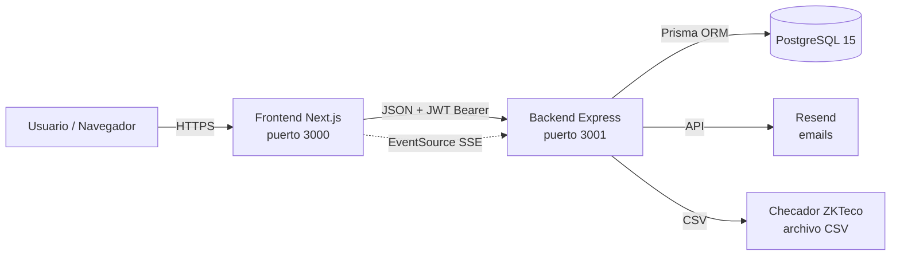
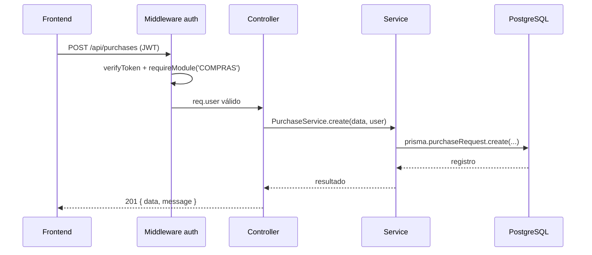

# Arquitectura del ERP KRAM

> Última actualización: 2026-06-24 · Fuente de verdad: código en `backend/src` y `frontend/`

## 1. Visión general

El ERP KRAM es una aplicación web de gestión empresarial con **frontend y backend desacoplados**, pensada para escalar, ser configurable y mantenible.



| Componente | Tecnología | Puerto | Descripción |
|---|---|---|---|
| Frontend | Next.js (App Router) + React + Tailwind | 3000 | UI y páginas de cada módulo |
| Backend | Node.js + Express | 3001 | API REST + SSE |
| Base de datos | PostgreSQL 15 | 5432 | Persistencia vía Prisma ORM |
| Emails | Resend | — | Notificaciones de cumpleaños/aniversarios |
| Asistencia | ZKTeco (importación CSV) | — | Registros del checador |

## 2. Estructura del repositorio

```
Mini-ERP-Kram/
├── backend/
│   ├── prisma/          ← schema.prisma (BD), seed.js, seed-prod.js
│   ├── src/
│   │   ├── config/      ← modules.config.js, roles.config.js
│   │   ├── controllers/ ← orquestadores HTTP (delgados)
│   │   ├── middlewares/ ← auth, permisos, upload, SSE
│   │   ├── routes/      ← definición de rutas Express
│   │   ├── services/    ← lógica de negocio (único lugar de Prisma)
│   │   ├── utils/
│   │   └── index.js     ← punto de entrada
│   └── Dockerfile
├── frontend/
│   ├── app/             ← páginas Next.js (App Router)
│   ├── components/      ← componentes reutilizables
│   ├── contexts/        ← AuthContext, etc.
│   ├── hooks/           ← hooks reutilizables
│   ├── lib/api/         ← clientes API
│   ├── constants/       ← navigation.js
│   └── Dockerfile
├── docs/                ← documentación (este directorio)
├── .github/workflows/   ← CI (backend-ci, frontend-ci)
└── docker-compose*.yml
```

## 3. Backend: separación en 3 capas

```
Rutas (routes/) → Controladores (controllers/) → Servicios (services/)
```

1. **Rutas** (`routes/*.routes.js`): montan endpoints, aplican middlewares de autenticación/permisos y delegan al controlador.
2. **Controladores** (`controllers/*.controller.js`): delgados. Validan request, llaman al servicio y devuelven respuesta HTTP estandarizada `{ data, message }` o `{ error }`. **Sin lógica de negocio ni consultas Prisma complejas.**
3. **Servicios** (`services/`): contienen la lógica de negocio y **el único lugar donde se usa Prisma** para operaciones complejas.

```js
// ✅ Controller orquestador
static async create(req, res) {
  try {
    const data = await PurchaseService.create(req.body, req.user);
    res.status(201).json({ data, message: 'Creado exitosamente' });
  } catch (error) {
    res.status(400).json({ error: error.message });
  }
}
```

## 4. Frontend

Separación de responsabilidades:

```
UI (componentes visuales)
  → Estado (hooks, contextos)
    → Servicios (lib/api/*.js)
      → Validaciones (schemas, helpers)
```

- Páginas delgadas (`app/**/page.js`), lógica compleja extraída a hooks/subcomponentes.
- Componentes interactivos con hooks llevan `'use client'`.
- Clientes de API centralizados en `frontend/lib/api/`.
- Fechas: el backend guarda en ISO/UTC; el frontend **siempre** formatea a `DD/MM/YYYY` extrayendo la fecha sin zona horaria (`.substring(0,10)` o `split('T')[0]`) para evitar el "bug del día anterior".

## 5. Modelo de seguridad (3 niveles)

| Nivel | Mecanismo | Uso |
|---|---|---|
| **A — Acceso a módulos** | `accessibleModules?.includes('MODULO')` + bypass ADMIN/RH | Mostrar menús, proteger rutas, validar endpoints |
| **B — Scoping de datos** | Atributos del empleado (departamento, nivel jerárquico) + bypass ADMIN/RH | Determinar QUÉ datos ve el usuario |
| **C — Operaciones críticas** | `requireRole(['ADMIN'])` | Cambiar permisos, eliminar usuarios, resetear BD |

- **ADMIN** y **RH** son los **Roles Estratégicos** con bypass global (Nivel A y B). Solo **ADMIN** tiene acceso a Nivel C.
- En backend: `requireModule('MODULO')`, `requireRole([...])`, `requireRHOrAdmin()`.
- En frontend: `user.accessibleModules?.includes('MODULO')` y `<ProtectedRoute requiredModule="...">`.

## 6. Fuentes de verdad (configuración)

| Dato | Archivo | Expuesto vía |
|---|---|---|
| Módulos | `backend/src/config/modules.config.js` | `GET /api/modules` |
| Presets por rol | `backend/src/config/roles.config.js` | `GET /api/roles/presets` |
| Roles del sistema | `backend/src/routes/roles.routes.js` (`SYSTEM_ROLES`) | `GET /api/roles` |
| Estructura BD | `backend/prisma/schema.prisma` | Prisma Migrate |

**Nunca** hardcodear listados de módulos/roles en el frontend: consumir los endpoints dinámicos.

## 7. Stack y dependencias clave

**Backend:** Express, Prisma (`@prisma/client`), PostgreSQL, JWT (`jsonwebtoken`), bcrypt/bcryptjs, Multer (uploads), node-cron (scheduler), PDFKit (órdenes de compra), xlsx (export Excel), csv-parser (checador), Resend (emails).

**Frontend:** Next.js, React, Tailwind CSS, Context API.

## 8. Flujo de una petición



## 9. Principios rectores

- **Configuración sobre código**: permisos/módulos/roles se configuran, no se hardcodean.
- **Separación de responsabilidades**: cada capa tiene un propósito único.
- **Principio de cambio mínimo**: extender antes que reescribir.