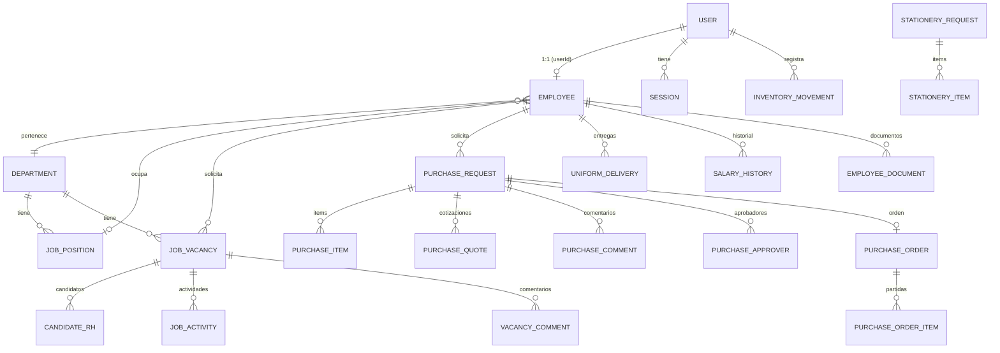

# Modelo de Datos (DER) — ERP KRAM

> Fuente de verdad: `backend/prisma/schema.prisma` · Base de datos: PostgreSQL 15 · ORM: Prisma

## 1. Diagrama Entidad-Relación (resumido)

## 2. Tablas principales

### Identidad y acceso

| Modelo | Tabla | Campos clave | Descripción |
|---|---|---|---|
| **User** | `users` | `id, email, password, name, role, accessibleModules[], isActive` | Cuenta de acceso. `role` es `RoleType`, `accessibleModules` es `ModuleType[]` |
| **Role** | `roles` | `id, name, description, color, icon, isCustom` | Roles personalizados (los del sistema viven en `SYSTEM_ROLES`) |
| **Session** | `sessions` | `id, userId, token, expiresAt` | Sesiones JWT persistidas |

### Estructura organizacional

| Modelo | Tabla | Campos clave | Descripción |
|---|---|---|---|
| **Department** | `departments` | `id, nombre, descripcion, estado` | Departamentos |
| **JobPosition** | `job_positions` | `id, nombre, nivelJerarquico, departamentoId` | Puestos de trabajo |
| **Employee** | `employees` | `id, userId, curp, rfc, nss, clave, nombres, apellidos, fecha_ingreso, salario (salarioMensual), sd, sdi, nivelJerarquico, departamento_id, puestoId, estatus, reportaAId` + campos personales/bancarios | Expediente completo del empleado |

> **Employee** es la tabla más amplia: incluye datos personales (fecha de nacimiento, sexo, nacionalidad, estado civil), domicilio, datos bancarios (banco, clabe, número de cuenta, beneficiarios), tallas de uniforme, jerarquía (`reportaAId` para autojerarquía) y campos de sueldo (`sd`, `sdi`, `salarioMensual`).

### Reclutamiento

| Modelo | Tabla | Campos clave | Descripción |
|---|---|---|---|
| **JobVacancy** | `job_vacancies` | `id, solicitanteId, jobPositionId, motivoSolicitud, tipoContratacion, numeroVacantes, estatus, requerimientos_tecnicos (Json)` | Solicitud de vacante (formato físico digitalizado) |
| **JobActivity** | `job_activities` | `id, vacancyId, activityType, description, duration, isCompleted` | Actividades del puesto |
| **CandidateRH** | `candidates_rh` | `id, vacancy_id, nombre, cv_url, psych_test_url, estatus` | Candidatos |
| **VacancyComment** | `vacancy_comments` | `id, vacancy_id, user_id, mensaje` | Comentarios |

### Compras

| Modelo | Tabla | Campos clave | Descripción |
|---|---|---|---|
| **PurchaseRequest** | `purchase_requests` | `id, folio (autoincrement), solicitanteId, departamentoId, estatus, requiereAutorizacion, autorizadoPorId` | Solicitud de compra |
| **PurchaseItem** | `purchase_items` | `id, requestId, productoServicio, cantidad` | Partidas de la solicitud |
| **PurchaseQuote** | `purchase_quotes` | `id, requestId, proveedor, monto, archivoUrl, isSelected` | Cotizaciones |
| **PurchaseComment** | `purchase_comments` | `id, requestId, userId, mensaje` | Comentarios (chat) |
| **PurchaseApprover** | `purchase_approvers` | `id, requestId, employeeId, estatus, comentarios` | Cadena de aprobación |
| **PurchaseOrder** | `purchase_orders` | `id, purchaseRequestId, numero (OC-AAAA-000001), proveedor, monto, pdfUrl` | Orden de compra |
| **PurchaseOrderItem** | `purchase_order_items` | `id, orderId, productoServicio, cantidad, precioUnitario, importe` | Partidas de la OC |
| **PurchaseAuditLog** | `purchase_audit_logs` | `id, requestId, userId, accion, valorAnterior/valorNuevo (Json)` | Auditoría de compras |

### Papelería y uniformes

| Modelo | Tabla | Campos clave | Descripción |
|---|---|---|---|
| **StationeryRequest** | `stationery_requests` | `id, solicitanteId, departamentoId, estatus, justificacion` | Solicitud de papelería |
| **StationeryItem** | `stationery_items` | `id, requestId, producto, cantidad, unidad` | Items de papelería |
| **StationeryInventory** | `stationery_inventory` | `id, producto, categoria, cantidadActual, cantidadMinima` | Inventario de papelería |
| **UniformInventory** | `uniform_inventory` | `id, tipo, talla, genero, cantidadActual, cantidadMinima` | Inventario de uniformes |
| **UniformDelivery** | `uniform_deliveries` | `id, empleadoId, items (Json), fechaEntrega, entregadoPorId` | Entregas de uniforme |

### Inventario (ajustes y kardex)

| Modelo | Tabla | Campos clave | Descripción |
|---|---|---|---|
| **InventoryAdjustmentRequest** | `inventory_adjustment_requests` | `id, tipo, accion, itemId, detalle (Json), motivo, estatus` | Solicitud de ajuste de inventario |
| **InventoryMovement** | `inventory_movements` | `id, tipo, tipoMovimiento, itemId, cantidad, stockAnterior, stockNuevo` | Kardex / movimientos |

### Asistencia y nómina

| Modelo | Tabla | Campos clave | Descripción |
|---|---|---|---|
| **AttendanceRecord** | `attendance_records` | `id, numeroEmpleado, nombreEmpleado, fechaHora, tipo, dispositivo` | Checadas del ZKTeco |
| **SalaryHistory** | `salary_history` | `id, employeeId, salarioNuevo, sdNuevo, sdiNuevo, factorUsado, tipoCambio` | Historial de sueldos |
| **FactorIntegracion** | `factores_integracion` | `id, anio, diasAguinaldo, diasVacaciones, primaVacacional, factor` | Factores de integración LFT |
| **NotificationLog** | `notification_logs` | `id, tipo, employeeId, email, estatus` | Log de notificaciones |

### Documentos

| Modelo | Tabla | Campos clave | Descripción |
|---|---|---|---|
| **EmployeeDocument** | `employee_documents` | `id, tipo_documento, url_archivo, employee_id, nombre_archivo, size_bytes` | Documentos del expediente |

### Vacaciones

| Modelo | Tabla | Campos clave | Descripción |
|---|---|---|---|
| **VacationRequest** | `vacation_requests` | `id, employeeId, fechaInicio, fechaFin, motivo, estatus, jefeAutorizadoPorId, jefeAutorizadoAt, comentarioJefe, aprobadoPorId, aprobadoAt, comentarioAprobacion` | Solicitud de vacaciones (flujo jefe→RH) |

## 3. Enumeraciones (`schema.prisma`)

| Enum | Valores |
|---|---|
| **RoleType** | `EMPLEADO_BASICO, ADMIN, RH, SISTEMAS, COMPRAS, PRODUCCION` |
| **ModuleType** | `EMPLEADOS, RECLUTAMIENTO, VACACIONES, INCIDENCIAS, CONFIGURACION, DASHBOARD, REPORTES, COMPRAS` |
| **NivelJerarquico** | `PRESIDENTE, DIRECTOR, GERENTE, JEFE, COORDINADOR, ANALISTA, SUPERVISOR, AUX_ADMINISTRATIVO, OPERATIVO` |
| **EmployeeStatus** | `Activo, Inactivo` |
| **VacancyStatus** | `Solicitada, Aprobada, Buscando, Cerrada` |
| **VacationStatus** | `PENDIENTE, AUTORIZADA, APROBADA, RECHAZADA, CANCELADA` |
| **CandidateStatus** | `En_Revision, Descartado, Seleccionado` |
| **MotivoVacante** | `NUEVA_CREACION, REEMPLAZO_DEFINITIVO, REEMPLAZO_TEMPORAL, REEMPLAZO_RENUNCIA, REEMPLAZO_TERMINACION_CONTRATO, INCREMENTO_PLANTILLA, INCREMENTO_PRODUCCION, RENUNCIA, TERMINACION_CONTRATO, LICENCIA, LICENCIA_TEMPORAL, INCAPACIDAD, JUBILACION, JUBILACION_RETIRO, PROMOCION, REESTRUCTURACION, MATERNIDAD, LICENCIA_MATERNIDAD, VACACIONES` |
| **TipoContratacion** | `ADMINISTRATIVO, TEMPORAL, SINDICALIZADO, TIEMPO_COMPLETO, PERMANENTE, BECARIO, ROL_TURNOS` |
| **PurchaseStatus** | `NUEVO, PENDIENTE, EN_AUTORIZACION, APROBADO, ENTREGADO, CANCELADO` |
| **StationeryStatus** | `PENDIENTE, ENTREGADO, CANCELADO` |

## 4. Convenciones de BD

- **IDs**: `cuid()` (string) para la mayoría; `autoincrement()` para `PurchaseRequest.folio` y `FactorIntegracion.id`.
- **`@map`**: nombres de tabla/columna en `snake_case` (ej. `job_vacancies`, `fecha_ingreso`).
- **Soft delete**: `Employee` usa `estatus` (Activo/Inactivo) y `fechaBaja`/`motivoBaja`; existe `DELETE /employees/:id/permanent` para baja física.
- **JSON**: `requerimientos_tecnicos`, `UniformDelivery.items`, `InventoryAdjustmentRequest.detalle`, `PurchaseAuditLog.valorAnterior/valorNuevo` usan columnas `Json`.
- **Índices**: en columnas de búsqueda frecuente (`estatus`, `fechaSolicitud`, `employeeId`, `fechaHora`).

## 5. Reglas de modificación

- **PROHIBIDO** renombrar tablas o columnas clave sin autorización explícita (rompe el frontend).
- No agregar campos calculados (edad, antigüedad, fechas en letras): se calculan en el frontend.
- Prohibido SQL directo; toda interacción vía Prisma.
- Escrituras críticas deben generar auditoría.
- Toda modificación del schema requiere migración (`npx prisma migrate dev`).
