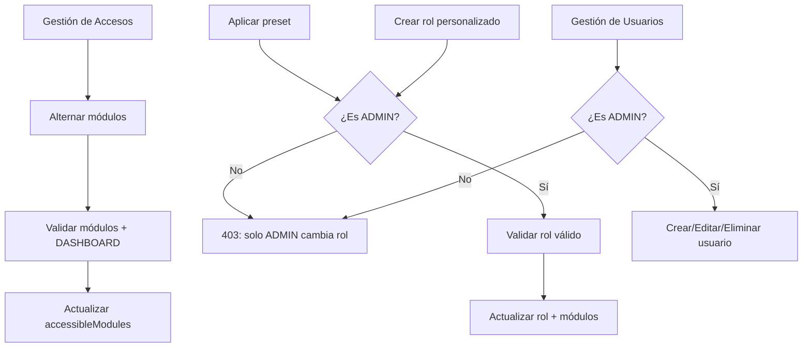

# Flujos del Módulo Configuración

## Diagrama general

## Flujo 1: Asignar/retirar módulos a un usuario

1. ADMIN/RH abre `/dashboard/accesos`.
2. Localiza al usuario y pulsa "Gestionar".
3. Marca/desmarca los módulos deseados.
4. El frontend llama `PUT /api/permissions/users/:id` con el nuevo `accessibleModules`.
5. El backend valida los módulos contra `modules.config.js` y **siempre incluye `DASHBOARD`**.

## Flujo 2: Aplicar preset por rol (solo ADMIN)

1. Solo ADMIN ve la sección "Aplicar preset por rol".
2. Pulsa el preset deseado y **confirma** (cambia rol + módulos).
3. El backend (`updateUserPermissions`) valida:
   - Solo **ADMIN** puede cambiar el rol (si es RH → 403).
   - El rol debe ser **válido** (sistema + personalizados).
4. Actualiza `role` y `accessibleModules` del usuario.

## Flujo 3: Crear rol personalizado (solo ADMIN)

1. En "Roles" (solo ADMIN), se crea un rol con nombre, descripción, color e icono.
2. El nombre se normaliza a mayúsculas/sin espacios.
3. Se valida que no exista ya (ni en sistema ni en personalizados).

## Flujo 4: Gestión de usuarios (solo ADMIN)

1. **Crear**: nombre, correo, contraseña y rol (`POST /api/users`).
2. **Editar**: nombre, correo, rol, estado y (opcional) contraseña (`PUT /api/users/:id`).
3. **Eliminar**: elimina la cuenta (`DELETE /api/users/:id`).
4. **Restablecer contraseña**: ADMIN y RH (`POST /api/users/:id/reset-password`).

## Notas de seguridad

- No se puede modificar los **propios permisos** (guard anti-bloqueo).
- Modelo de 3 niveles: módulos (A), scoping (B), operaciones críticas (C, solo ADMIN).
