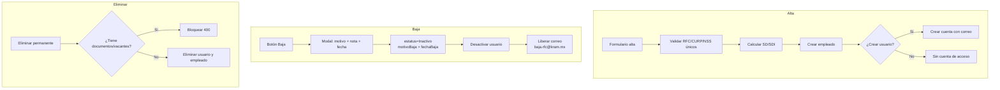

# Flujos del Módulo Empleados

## Diagrama general

## Flujo 1: Alta de empleado

1. RH/Admin abre `/rh/empleados` → "Nuevo Empleado".
2. Completa el formulario por secciones (personales, laborales, contacto, legales, financieros, etc.).
3. El backend valida campos requeridos (RFC, CURP, NSS, fecha de ingreso, puesto, departamento).
4. Valida **unicidad** de RFC/CURP/NSS.
5. Calcula **SD/SDI** automáticamente a partir del salario y fecha de ingreso.
6. Crea el empleado (`POST /api/employees`).
7. (Opcional) Si se marca "crear usuario", crea la cuenta de acceso con el correo institucional.
8. Registra el historial de sueldos (tipo `ALTA`).

## Flujo 2: Edición por secciones

1. RH/Admin abre el expediente (`/rh/empleados/[id]`).
2. Edita una sección (personal, laboral, contacto, etc.) mediante el modal correspondiente.
3. El backend actualiza (`PUT /api/employees/:id`).
4. Si cambia el salario, registra el cambio en el historial de sueldos (tipo `INCREMENTO`/`DECREMENTO`).

## Flujo 3: Baja (con motivo)

1. En la lista, el usuario pulsa el botón **"Baja"**.
2. Se abre un **modal** pidiendo:
   - **Motivo** (Renuncia, Despido, Fin de contrato, Abandono, Otro).
   - **Nota/detalle** (opcional).
   - **Fecha de baja** (por defecto hoy).
3. Al confirmar, el backend (`PUT /api/employees/:id`):
   - Cambia `estatus` a `Inactivo`.
   - Guarda `fechaBaja` y `motivoBaja`.
   - **Desactiva** la cuenta de usuario (`isActive: false`).
   - **Libera el correo institucional** (renombra el email a `baja.<rfc>@kram.mx`) para poder reutilizarlo.

## Flujo 4: Eliminación permanente

1. El usuario pulsa "Eliminar" (con confirmación).
2. El backend verifica que el empleado **no tenga** documentos ni vacantes asociadas (si los tiene, bloquea con 400).
3. Elimina el usuario vinculado y el registro del empleado.

## Flujo 5: Importación/Exportación CSV

1. **Importar**: se sube el CSV → se parsea → se validan filas (RFC/CURP/NSS únicos, estatus válido) → se crean/actualizan empleados.
2. **Exportar**: se genera y descarga el CSV con todos los empleados.
3. **Plantilla**: se descarga una plantilla CSV con las columnas esperadas.

## Flujo 6: Documentos y foto

1. Subida de documentos: se valida tipo y extensión, se guarda en `uploads/employee-documents/`.
2. Foto de perfil: se sube por endpoint separado y se guarda la URL en `fotoUrl`.
