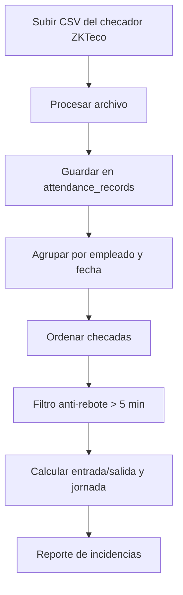

# Flujos del Módulo Incidencias (Asistencia)

## Diagrama general

## Flujo 1: Carga de asistencia (checador ZKTeco)

1. RH/Admin abre `/rh/incidencias`.
2. Selecciona el archivo **CSV** exportado del reloj checador.
3. El backend recibe el archivo (`POST /api/incidencias/upload`, con `requireModule('INCIDENCIAS')`).
4. Procesa y guarda los registros de asistencia en `attendance_records` (con `skipDuplicates`).

## Flujo 2: Procesamiento de checadas

1. El sistema agrupa las checadas por **empleado y fecha**.
2. Ordena los *punches* por hora.
3. Aplica el **filtro anti-rebote** (> 5 min entre checadas).
4. Calcula entrada/salida y la jornada del día.

## Flujo 3: Reporte de incidencias

1. El usuario consulta por **rango de fechas** y filtros (`GET /api/incidencias`).
2. El sistema devuelve los registros y el reporte de **incidencias** (faltas, retardos, etc.).

## Notas

- Acceso: usuarios con el módulo `INCIDENCIAS` (ADMIN/RH lo tienen por preset).
