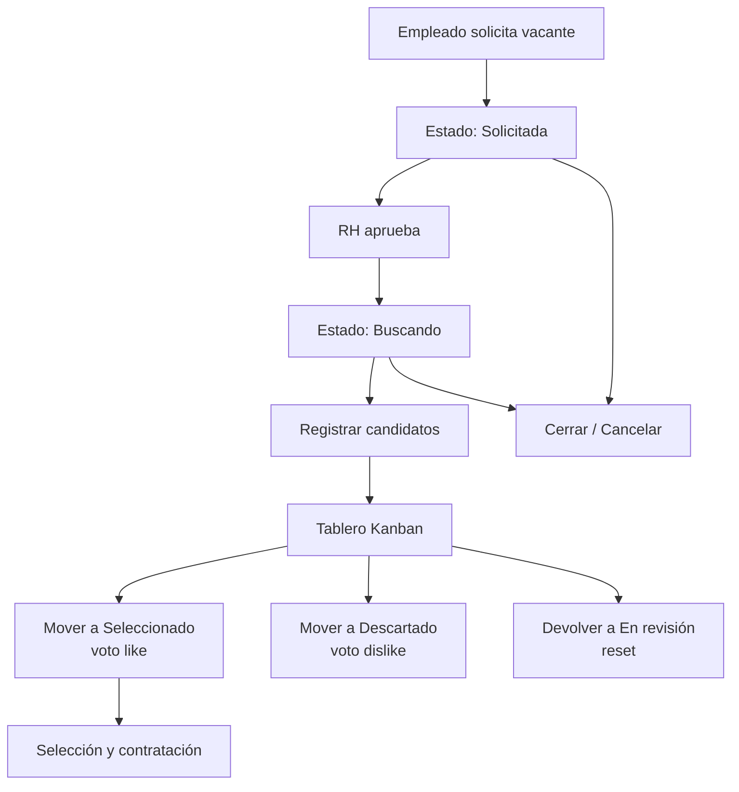

# Flujos del Módulo Reclutamiento

## Diagrama general

## Flujo 1: Requisición de personal

1. El empleado crea una **solicitud de vacante** (`/reclutamiento/solicitar-vacante`).
2. Completa el perfil, justificación, requisitos técnicos y actividades.
3. La vacante queda en estado `Solicitada`.

## Flujo 2: Aprobación de la requisición

1. RH/Admin revisa la solicitud en `/rh/reclutamiento`.
2. La **aprueba** (`PUT /api/recruitment/vacancies/:id/approve`).
3. El estado pasa de `Solicitada` → `Aprobada` → `Buscando`.

## Flujo 3: Gestión de candidatos (Kanban)

1. En el detalle de la vacante (estado `Buscando`), se registran **candidatos** (con CV y pruebas psicométricas).
2. Los candidatos aparecen en el tablero Kanban con columnas: `En_Revision`, `Seleccionado`, `Descartado`.
3. Arrastrando entre columnas:
   - Hacia `Seleccionado` → voto **visto bueno (like)**.
   - Hacia `Descartado` → voto **no seleccionado (dislike)**.
   - De vuelta a `En_Revision` → **reset** (solo RH/Admin).
4. Solo el **solicitante** puede votar like/dislike; RH/Admin pueden resetear.

## Flujo 4: Selección y contratación

1. Se selecciona al candidato (`PUT /api/recruitment/candidates/:id/select`).
2. Se registra la selección y puede iniciarse el proceso de contratación.

## Flujo 5: Cierre / Cancelación

1. RH/Admin cierra (`/close`) o cancela (`/cancel`) la vacante.
2. El estado pasa a `Cerrada`.

## Flujo 6: Comentarios y perfil técnico

1. Los participantes agregan **comentarios** en la vacante.
2. Se completa el **perfil técnico detallado** y las **actividades** de la vacante.
