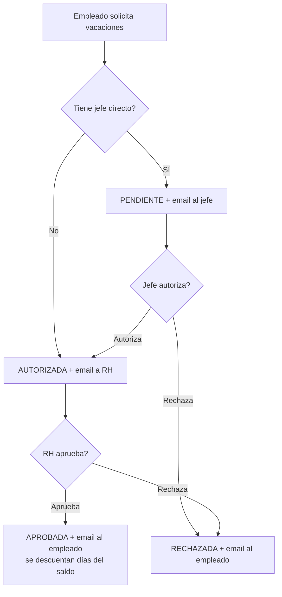

# Flujo de Vacaciones

> Módulo: VACACIONES · Permiso: `requireModule('VACACIONES')` · Aprobación RH: `requireRole(['ADMIN','RH'])`

## Descripción

Solicitud de vacaciones con aprobación en **dos niveles** (jefe directo → RH), **saldo por antigüedad** (LFT) y **notificaciones por email**.

## Flujo

## Estados

| Estado | Significado |
|---|---|
| `PENDIENTE` | Esperando autorización del jefe directo |
| `AUTORIZADA` | Autorizada por jefe (o sin jefe), esperando aprobación de RH |
| `APROBADA` | Aprobada por RH y registrada (descuenta días) |
| `RECHAZADA` | Rechazada por jefe o RH |
| `CANCELADA` | Cancelada por el empleado |

## Saldo de días (según antigüedad LFT)

- `diasCorresponden` = días por antigüedad desde `factores_integracion` (`salaryCalculator`).
- `diasUsados` = suma de días de solicitudes `APROBADAS` en el periodo de aniversario vigente.
- `diasDisponibles` = corresponden − usados (expuesto en `GET /vacations/balance`).
- La creación se **rechaza** si los días solicitados superan los disponibles.

## Notificaciones (email vía Resend)

1. Empleado solicita → email al **jefe directo** (`employee.reportaA.user`).
2. Jefe autoriza (o sin jefe) → email a **RH** (`role in ['RH','ADMIN']`).
3. RH aprueba/rechaza → email al **empleado**.
